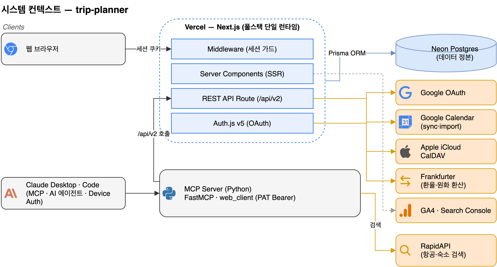
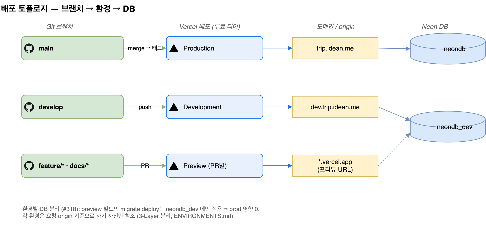
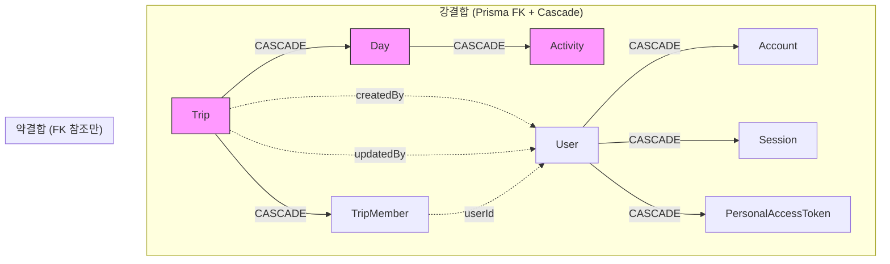
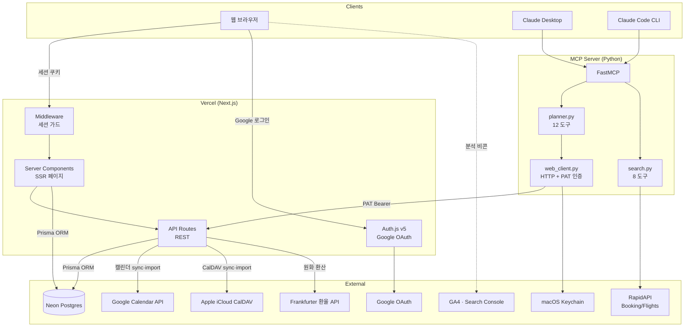
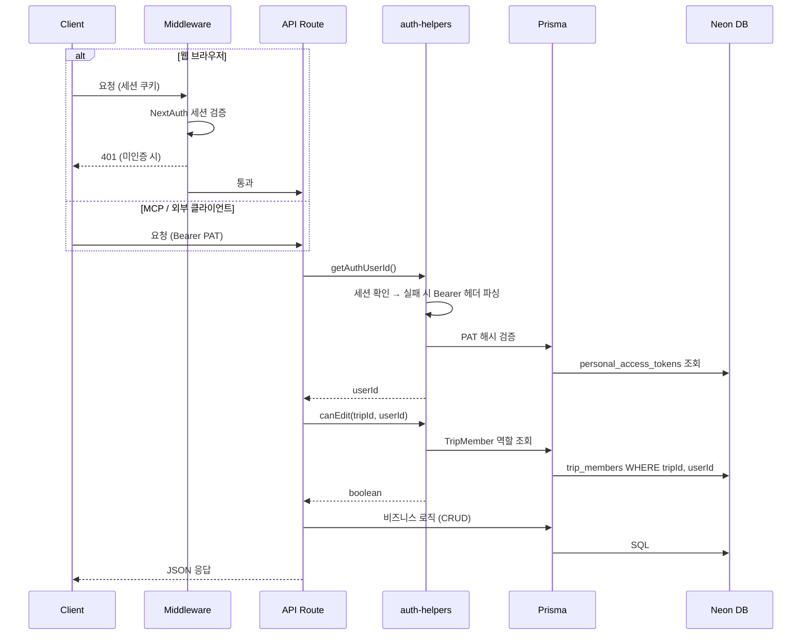
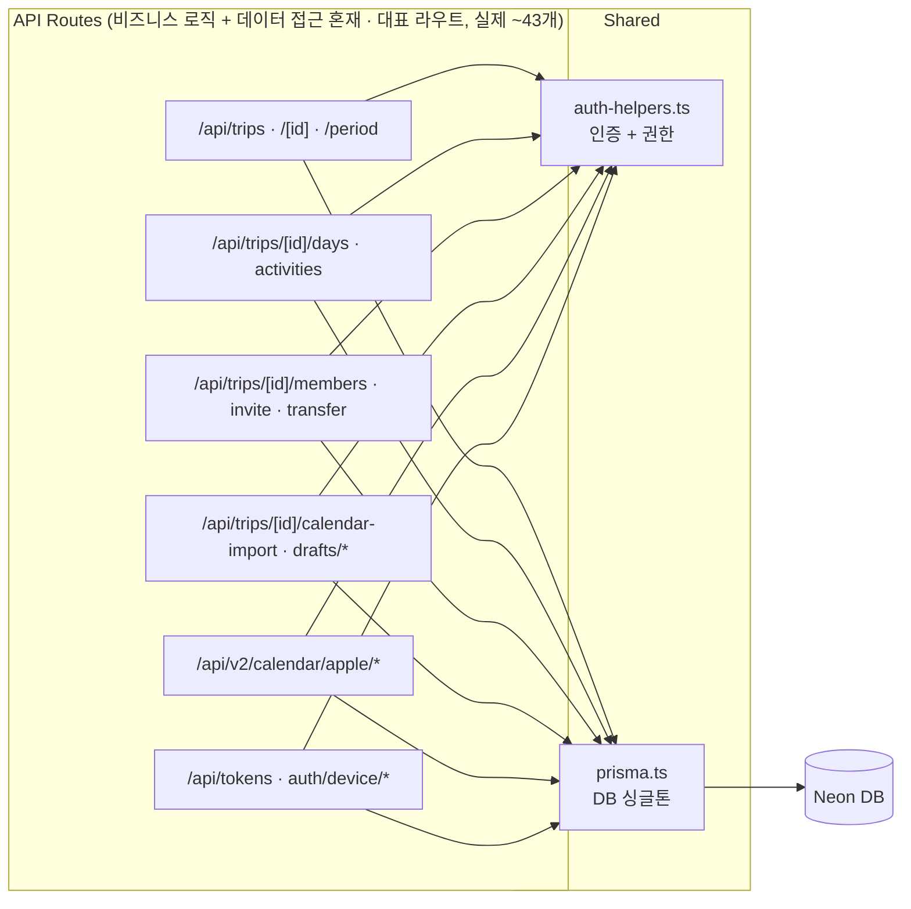
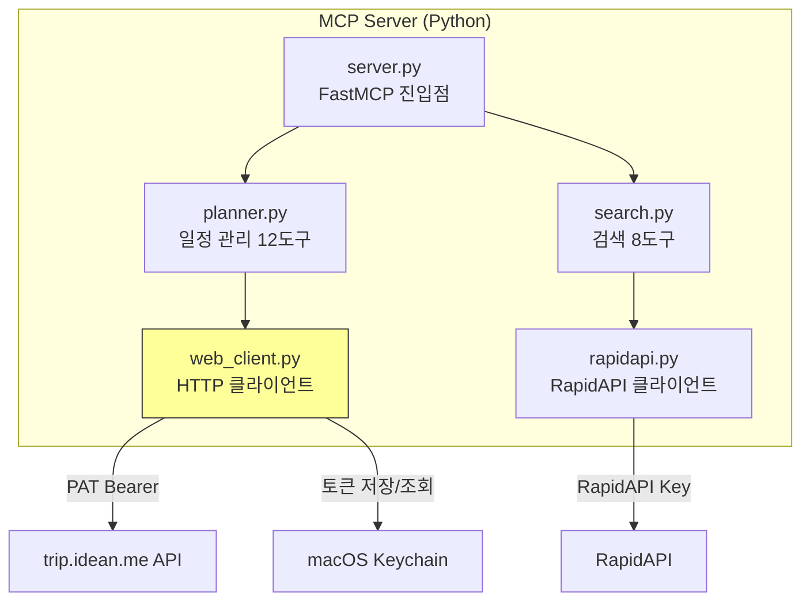

# 아키텍처

> **대상 독자**: 기여자·개발자, 그리고 이 프로젝트의 설계·운영 방식을 빠르게 훑으려는 분(채용·기술 리뷰 포함).
> 이 문서 하나로 **"구조를 어떻게 짰고, 스펙·품질을 어떻게 관리하는가"** 를 파악할 수 있게 구성했다. 그림을 먼저 보고, 왜 그렇게 했는지는 그림 아래에서 읽으면 된다.

## 시스템 구성도

클라이언트 둘(웹 브라우저 · MCP/AI 에이전트)이 Vercel 위의 Next.js 단일 런타임 한 곳을 경유해 같은 데이터 정본(Neon Postgres)에 닿는다. 외부 연동(Google·Apple 캘린더, 환율, 검색)은 모두 이 런타임 뒤에 붙는다.

### 왜 이렇게 했나

> 한 줄 요약: **1인 운영 + 무료 티어라는 제약을 운영 표면 최소화로 푼다.** 결정 근거는 [ADR-0008 — Next.js 풀스택 단일 런타임 + Vercel 무료 티어](./adr/0008-nextjs-fullstack-single-runtime.md).

이 프로젝트의 구조는 세 가지 제약에서 나왔다 — 운영 인력 1명, 금전 비용 0원(헌법 II — Minimum Cost), 클라이언트 둘(웹 브라우저 + MCP/AI 에이전트).

- **왜 React SPA가 아니라 서버를 도입했나.** SSR·세션 가드·OAuth·동행자 권한 검증은 서버가 있어야 풀린다. SPA로 가면 별도 백엔드 서버가 따로 필요해지고, 배포 대상·CORS·토큰 교환 인프라가 늘어 1인 운영 표면이 배가된다.
- **왜 별도 백엔드 없이 Next.js 단일 런타임인가.** 하나의 Next.js 앱이 서버 컴포넌트 SSR·REST API·미들웨어·Auth.js OAuth를 모두 담당한다. 배포 대상 1개, CI 1개, 인증 인프라 1개로 유지 비용을 누른다.
- **왜 웹·MCP가 같은 정본 하나로 모이나.** DB 접근은 Next.js 서버 한 곳으로 모은다. MCP(Python)는 DB에 직접 붙지 않고 REST API(`/api/v2`)의 클라이언트로 동작해, 두 클라이언트가 같은 데이터 정본을 본다.
- **왜 서비스 계층 없이 라우트가 Prisma를 직접 호출하나.** 현재 규모에 맞춘 의도적 선택이다. 추상화 선투자 대비 이득이 작다고 판단했고, 한계와 전환 신호는 [아래 "현재 한계"](#현재-한계)와 ADR-0008에 함께 기록했다.

## 배포 토폴로지

Git 브랜치가 배포 환경에 매핑되고, 환경별로 DB가 분리(#318)된다.

### 왜 이렇게 했나

- **브랜치 = 환경.** `main` → 프로덕션(trip.idean.me), `develop` → 개발(dev.trip.idean.me), `feature/*`·`docs/*` → PR별 프리뷰 URL. 어디에 무엇이 배포됐는지 브랜치만 보면 안다.
- **환경별 DB 분리로 프리뷰가 프로덕션을 건드리지 않는다.** Production은 `neondb`, Preview·Development는 `neondb_dev`. 프리뷰 빌드의 `prisma migrate deploy`는 `neondb_dev`에만 적용돼 프로덕션 영향이 0이다.
- **각 환경은 요청 origin 기준으로 자기 자신만 참조한다.** 교차 참조를 구조적으로 막는 3-Layer URL 도출 규칙은 [ENVIRONMENTS.md](./ENVIRONMENTS.md)에 정본으로 둔다.

> **도식 편집 규약** — 편집 정본은 [`docs/diagrams/workspace/*.drawio`](./diagrams/workspace/)이고, GitHub·문서 표시는 draw.io가 내보낸 `.png`다. draw.io의 SVG 내보내기는 텍스트를 `foreignObject`로 담아 GitHub ``에서 렌더되지 않으므로 PNG를 표시본으로 쓴다. `.drawio`를 고치면 PNG를 다시 내보내 함께 커밋한다. 상세는 [`workspace/README.md`](./diagrams/workspace/README.md). 아래 mermaid 다이어그램은 git diff로 변경 추적이 쉬운 세부 흐름용이다.

## 도메인 구조

여행(Trip)을 최상위 집합체로 두고, 그 아래 일자(Day)·활동(Activity)이 강하게 묶인다. 사용자(User)·동행자(TripMember)·인증 토큰은 사용자 계정에 묶인다. 바운디드 컨텍스트와 데이터 소유권 상세는 [DOMAIN.md](./DOMAIN.md), 스키마는 [ERD.md](./ERD.md).

- **Trip → Day → Activity: 강결합** — Cascade 삭제에 의존한다. Trip을 지우면 Day·Activity가 DB 레벨에서 연쇄 삭제된다.
- **도메인 이벤트 없음** — 삭제 시 부가 작업(로그·알림)을 끼워 넣을 지점이 아직 없다.
- **도메인 간 호출** — 라우트가 다른 도메인의 Prisma 모델을 직접 참조한다. 규모가 커지면 이 지점이 서비스 계층 도입의 첫 신호다(["현재 한계"](#현재-한계) 참조).

## 시스템 개요

도메인이 위 구조라면, 실행 시점의 전체 구성요소와 흐름은 다음과 같다.

> 클라이언트 인증은 셋 — 웹은 세션 쿠키(Auth.js), 외부 클라이언트는 PAT Bearer, 헤드리스 에이전트는 Device Authorization Grant(spec 060). GA4·Search Console은 공개 페이지 한정 분석·검색 노출용이며 앱 화면은 noindex다(spec 057). 인증·데이터 접근의 세부 흐름은 [아래 "세부 흐름"](#세부-흐름-구현-참조)에 둔다.

## 스펙·품질 관리

1인 개발이지만 스펙·품질 관리는 자동 게이트로 강제한다. 업무 프로세스 전 과정의 정본은 [WORKFLOW.md](./WORKFLOW.md)이며, 아래는 그 요약이다.

- **스펙 우선(speckit).** 피처마다 `spec → plan → tasks` 순으로 산출물을 만든다. 스펙은 WHAT·WHY만 담고, 구체적 도구·구현은 plan에서 정한다.
- **메타태그 하네스.** `tasks.md`·`plan.md`·마이그레이션 SQL에 4종 메타태그(`[artifact]`·`[why]`·`[multi-step]`·`[migration-type]`)를 달고, `validate-*.sh` 스택이 형식·plan↔tasks 커버리지·drift(선언 대비 실제 산출물)를 검증한다. PR 단계는 `speckit-gate.yml`, 주간 drift 점검은 `drift-audit.yml`이 맡는다.
- **Git Flow Lite.** `feature/*`·`hotfix/*` → `develop`(개발 통합) → `release/vX.Y.Z` → `main`(프로덕션). 버전 태그는 `main`에만 붙는다. 모든 PR은 merge commit으로 합친다.
- **릴리즈 노트 자동화(towncrier).** 코드 변경마다 `changes/<이슈>.<타입>.md` 단편을 하나 추가한다. 릴리즈 시 단편이 `CHANGELOG.md`로 자동 합쳐지고, 태그 push가 GitHub Release·PyPI 배포·`main → develop` 동기화 PR을 자동으로 잇는다.

## 세부 흐름 (구현 참조)

위 구조를 코드 레벨에서 확인할 때 참조한다. 시스템 이해에는 앞 절만으로 충분하며, 이 절은 구현·디버깅 시점의 상세다.

### 인증 흐름

### 데이터 접근 구조

> 위는 자원군 대표 라우트다. 폐지된 경로(`gcal/*`, `v2/calendar/{connect,subscribe,sync}`는 410 Gone)를 포함하면 실제 라우트는 ~43개지만, 모두 동일한 **라우트 → auth-helpers → Prisma** 패턴을 따른다. 각 라우트가 독립적으로 인증 → 권한 → Prisma 쿼리 → 응답을 수행하고, 서비스/레포지토리 계층은 두지 않는다.

### MCP 서버 구조

`web_client.py` 인증 흐름: ① macOS Keychain에서 PAT 조회 → ② API 호출 시 Bearer 헤더 첨부 → ③ 401 응답 시 브라우저 OAuth 자동 재인증 → 새 PAT 발급 → 요청 재시도.

## 현재 한계

| 항목 | 현재 상태 | 영향 |
|------|----------|------|
| **서비스 계층 부재** | 라우트에 Prisma 직접 호출 | 비즈니스 로직 재사용 불가, 테스트 시 Prisma mock 필수 |
| **도메인 이벤트 없음** | Cascade 삭제에 의존 | 삭제 시 부가 작업(로그, 알림) 추가 불가 |
| **권한 체크 반복** | 모든 라우트에서 동일 패턴 | 중복 코드, 누락 위험 |
| **트랜잭션 범위** | 라우트 단위 단일 쿼리 | 복합 작업 시 부분 실패 가능 |
| **프론트-백 결합** | Server Component가 Prisma 직접 호출 | API 분리 시 전면 리팩토링 필요 |
