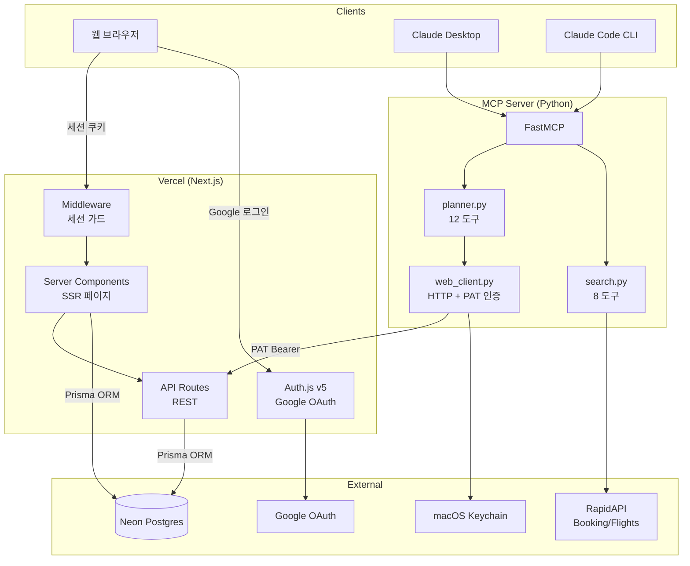
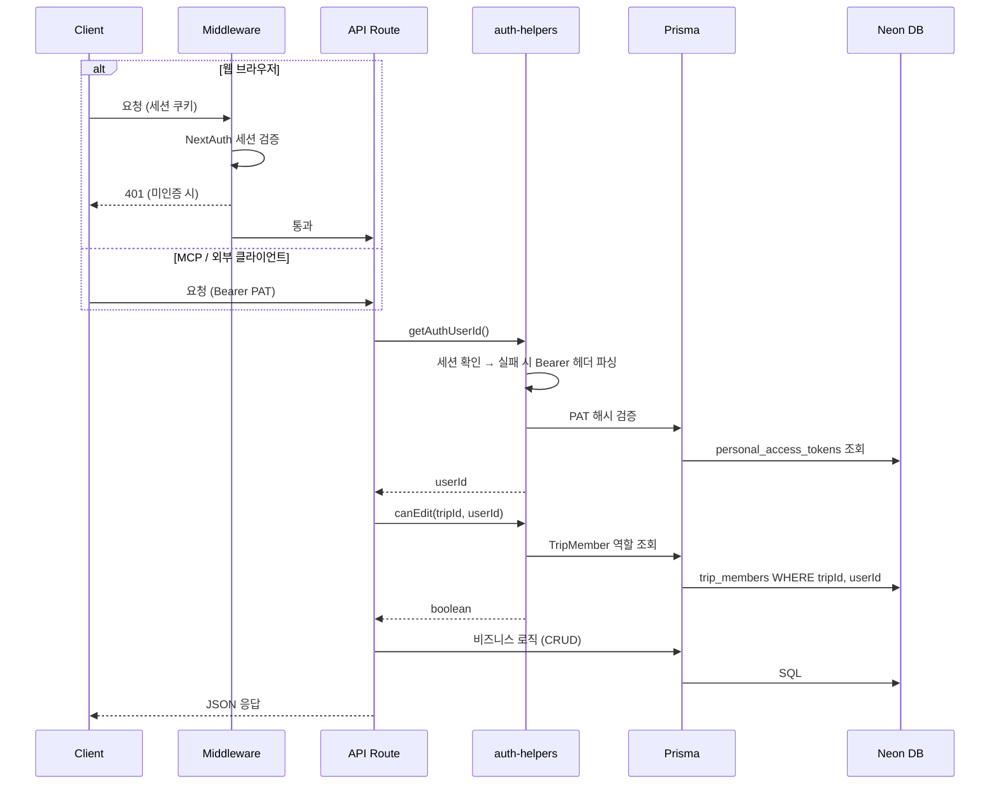
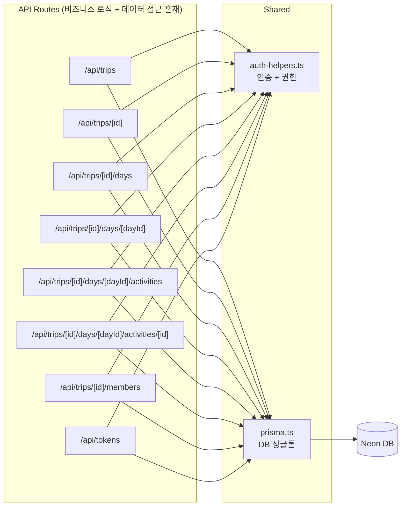
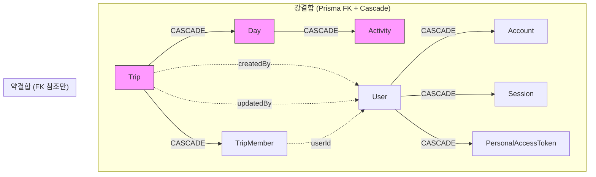
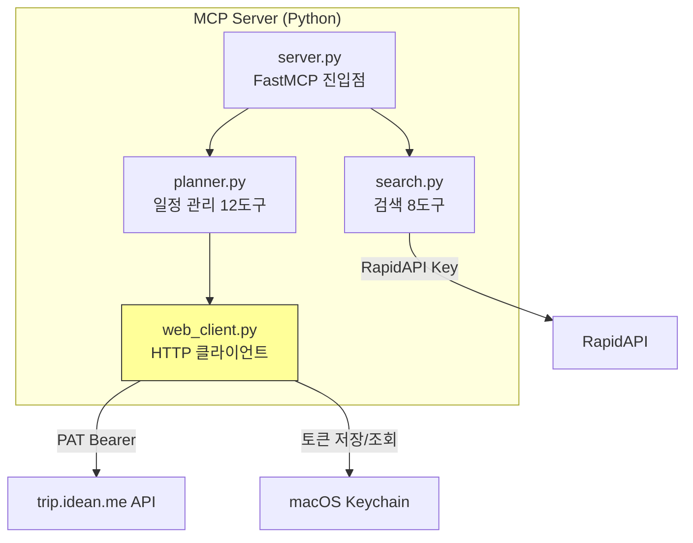

# 아키텍처

> **대상 독자**: 기여자·개발자 — 전체 시스템 구성 요소와 흐름을 파악하려는 분.

## 설계 사상

> 한 줄 요약: **1인 운영 + 무료 티어라는 제약을 운영 표면 최소화로 푼다.** 자세한 결정 근거는 [ADR-0008 — Next.js 풀스택 단일 런타임 + Vercel 무료 티어](./adr/0008-nextjs-fullstack-single-runtime.md).

이 프로젝트의 구조는 세 가지 제약에서 나왔다 — 운영 인력 1명, 금전 비용 0원(헌법 II — Minimum Cost), 클라이언트 둘(웹 브라우저 + MCP/AI 에이전트).

- **왜 React SPA가 아니라 서버를 도입했나.** SSR·세션 가드·OAuth·동행자 권한 검증은 서버가 있어야 풀린다. SPA로 가면 별도 백엔드 서버가 따로 필요해지고, 배포 대상·CORS·토큰 교환 인프라가 늘어 1인 운영 표면이 배가된다.
- **왜 별도 백엔드 없이 Next.js 단일 런타임인가.** 하나의 Next.js 앱이 서버 컴포넌트 SSR·REST API·미들웨어·Auth.js OAuth를 모두 담당한다. 배포 대상 1개, CI 1개, 인증 인프라 1개로 유지 비용을 누른다.
- **왜 웹·MCP가 같은 정본 하나로 모이나.** DB 접근은 Next.js 서버 한 곳으로 모은다. MCP(Python)는 DB에 직접 붙지 않고 REST API(`/api/v2`)의 클라이언트로 동작해, 두 클라이언트가 같은 데이터 정본을 본다.
- **왜 서비스 계층 없이 라우트가 Prisma를 직접 호출하나.** 현재 규모에 맞춘 의도적 선택이다. 추상화 선투자 대비 이득이 작다고 판단했고, 한계와 전환 신호는 [아래 "현재 한계"](#현재-한계)와 ADR-0008에 함께 기록했다.

대표 도식은 [`docs/diagrams/`](./diagrams/)에 둔다 — 편집 정본은 `.drawio`, GitHub·문서 표시는 draw.io가 내보낸 `.png`다. 아래 mermaid 다이어그램은 git diff로 변경 추적이 쉬운 세부 흐름용이다.

### 대표 도식

**시스템 컨텍스트** — 클라이언트 둘(웹·MCP)이 Next.js 단일 런타임 한 곳을 경유해 같은 데이터 정본에 닿는다.

**배포 토폴로지** — Git 브랜치가 환경에 매핑되고, 환경별 DB가 분리(#318)된다.

> 도식을 고치려면 편집 정본 `docs/diagrams/*.drawio`를 draw.io(또는 VS Code Draw.io Integration)에서 열어 수정한 뒤 PNG로 다시 내보낸다. GitHub·문서 표시는 `.png`다 — draw.io의 SVG 내보내기는 텍스트를 `foreignObject`로 담아 GitHub ``에서 렌더되지 않으므로 PNG를 표시본으로 쓴다.

## 시스템 개요

## 인증 흐름

## 데이터 접근 구조 (현재)

**특징:**
- 서비스/레포지토리 계층 없음 — 라우트가 Prisma를 직접 호출
- 각 라우트가 독립적으로 인증 → 권한 → Prisma 쿼리 → 응답 수행
- 비즈니스 로직과 데이터 접근이 라우트 핸들러에 혼재

## 도메인 결합도

**현재 도메인 의존 관계:**
- Trip → Day → Activity: 강결합 (Cascade 삭제 의존)
- 도메인 이벤트 없음: Trip 삭제 시 Day/Activity가 DB 레벨에서 연쇄 삭제
- 도메인 간 호출: 라우트가 다른 도메인의 Prisma 모델을 직접 참조

## MCP 서버 구조

**web_client.py 인증 흐름:**
1. macOS Keychain에서 PAT 조회
2. API 호출 시 Bearer 헤더 첨부
3. 401 응답 시 브라우저 OAuth 자동 재인증 → 새 PAT 발급 → 요청 재시도

## 현재 한계

| 항목 | 현재 상태 | 영향 |
|------|----------|------|
| **서비스 계층 부재** | 라우트에 Prisma 직접 호출 | 비즈니스 로직 재사용 불가, 테스트 시 Prisma mock 필수 |
| **도메인 이벤트 없음** | Cascade 삭제에 의존 | 삭제 시 부가 작업(로그, 알림) 추가 불가 |
| **권한 체크 반복** | 모든 라우트에서 동일 패턴 | 중복 코드, 누락 위험 |
| **트랜잭션 범위** | 라우트 단위 단일 쿼리 | 복합 작업 시 부분 실패 가능 |
| **프론트-백 결합** | Server Component가 Prisma 직접 호출 | API 분리 시 전면 리팩토링 필요 |
