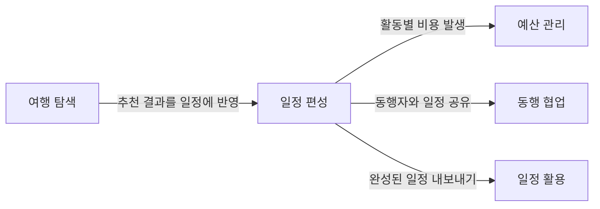
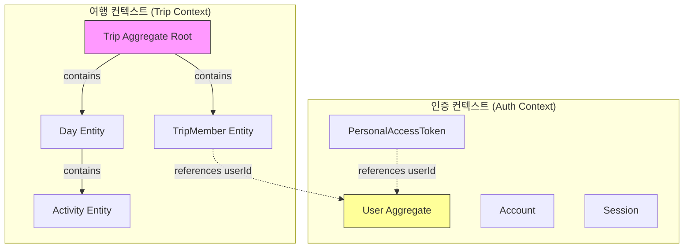
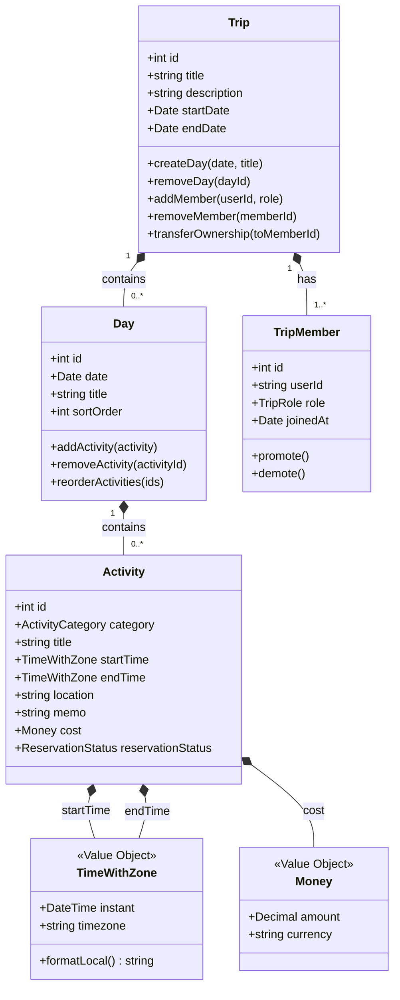
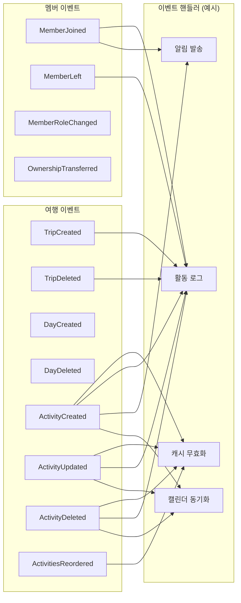

# 도메인 모델

## 기획 도메인

사용자가 해결하는 문제 기준. 기술 수단은 포함하지 않는다.

| # | 도메인 | 사용자 질문 | 설명 |
|---|--------|-----------|------|
| 1 | **여행 탐색** | 어디 가지? 뭐 하지? | 숙소, 항공편, 관광지, 식당 검색 및 추천 |
| 2 | **일정 편성** | 언제 뭘 하지? | 일자별 활동 구성, 시간/장소/예약 상태 관리 |
| 3 | **예산 관리** | 얼마 쓰지? | 활동별 비용 추적, 통화 구분, 결제 수단 |
| 4 | **동행 협업** | 누구랑 가지? | 동행자 초대, 역할 관리, 공동 편집 |
| 5 | **일정 활용** | 어떻게 보지? | 캘린더 연동, PDF 추출, 모바일 접근 |

### 도메인 관계



### 기획 → 기술 도메인 매핑

| 기획 도메인 | 기술 구현 | 현재 스펙 |
|-----------|----------|----------|
| 여행 탐색 | RapidAPI 검색 MCP (숙소/항공/관광지) | 001, 005 |
| 일정 편성 | Trip/Day/Activity CRUD, 웹 API | 004, 006 |
| 예산 관리 | Money VO (cost + currency) | 006 (부분) |
| 동행 협업 | TripMember, JWT 초대, OAuth 인증 | 004, 007 |
| 일정 활용 | iCal MCP, PDF 스크립트 | 002 |

### 현재 구현 상태

| 기획 도메인 | 상태 | 비고 |
|-----------|------|------|
| 여행 탐색 | ✅ 완료 | MCP 검색 8도구 |
| 일정 편성 | ✅ 완료 | Activity CRUD + 시간대 |
| 예산 관리 | ⚠️ 부분 | 활동별 비용만. 예산 총괄/결제수단 미구현 |
| 동행 협업 | ✅ 완료 | 초대/역할/권한 |
| 일정 활용 | ⚠️ 부분 | iCal 연동만. PDF 미구현 |

---

## 기술 도메인

기획 도메인에서 추출한 구현 단위. DDD + 이벤트 드리븐 관점.

### 바운디드 컨텍스트



**2개 컨텍스트:**
- **여행 컨텍스트**: 기획 도메인 1~4를 포함. Trip이 루트 애그리거트
- **인증 컨텍스트**: Auth.js v5 관리 영역. userId로만 여행 컨텍스트와 연결

### 용어 사전 (specs/004 기준)

| 한글 | 영문 | 정의 |
|------|------|------|
| 여행 | Trip | 최상위 단위. 제목, 기간, 일정 포함 |
| 일정 | Day | 일별 일정. 여행에 속하며 날짜, 활동 포함 |
| 활동 | Activity | 일정 내 구조화된 항목 (관광, 식사, 이동 등) |
| 멤버 | TripMember | 여행 참여자. 역할(주인/호스트/게스트) 포함 |
| 주인 | OWNER | 여행 생성자. 여행당 1명. 양도 가능. 전체 권한 |
| 호스트 | HOST | 함께 기획하는 동행자. 편집 + 초대 가능 |
| 게스트 | GUEST | 조회만 가능한 동행자 |
| 초대 | Invite | JWT 토큰 기반 링크. 별도 테이블 없음 |

### 애그리거트



### 권한 매트릭스

| 행위 | OWNER | HOST | GUEST |
|------|-------|------|-------|
| 여행 조회 | O | O | O |
| 일정/활동 편집 | O | O | X |
| 멤버 초대 | O | O | X |
| 멤버 제거 | O (호스트 포함) | O (게스트만) | X |
| 호스트 승격/강등 | O | X | X |
| 여행 삭제 | O | X | X |
| 주인 양도 | O (→HOST) | X | X |

### 밸류 오브젝트

| VO | 구성 | 설명 |
|----|------|------|
| **TimeWithZone** | instant (Timestamptz) + timezone (IANA) | 시각 + 표시 시간대. timezone NULL이면 Day 도시 기준 |
| **Money** | amount (Decimal) + currency (VARCHAR) | 비용 + ISO 4217 통화 코드 |
| **ActivityCategory** | enum | SIGHTSEEING, DINING, TRANSPORT, ACCOMMODATION, SHOPPING, OTHER |
| **ReservationStatus** | enum | REQUIRED, RECOMMENDED, ON_SITE, NOT_NEEDED |
| **TripRole** | enum | OWNER, HOST, GUEST |

### 도메인 이벤트



---

## 현재 → 목표 구조

| 항목 | 현재 | 목표 (DDD + 이벤트 드리븐) |
|------|------|--------------------------|
| **비즈니스 로직** | API Route에 혼재 | Service 계층 분리 |
| **데이터 접근** | Route → Prisma 직접 | Service → Repository → Prisma |
| **도메인 행위** | 없음 (CRUD만) | 애그리거트 메서드 |
| **삭제 전파** | DB FK Cascade | 도메인 이벤트 → 핸들러 |
| **부가 작업** | 불가 | 이벤트 핸들러로 확장 |

### 목표 레이어

```
src/
├── domain/              # 도메인 모델 (순수 TypeScript)
│   └── trip/
│       ├── trip.ts            # Trip 애그리거트
│       ├── day.ts             # Day 엔티티
│       ├── activity.ts        # Activity 엔티티
│       ├── trip-member.ts     # TripMember 엔티티
│       ├── value-objects.ts   # TimeWithZone, Money
│       └── events.ts          # 도메인 이벤트
├── application/         # 유스케이스 (서비스)
│   ├── trip-service.ts
│   ├── activity-service.ts
│   └── member-service.ts
├── infrastructure/      # 인프라 (Prisma, 이벤트 버스)
│   ├── repositories/
│   └── events/
└── app/                 # Next.js (프레젠테이션)
    └── api/             # 얇은 라우트 핸들러
```
