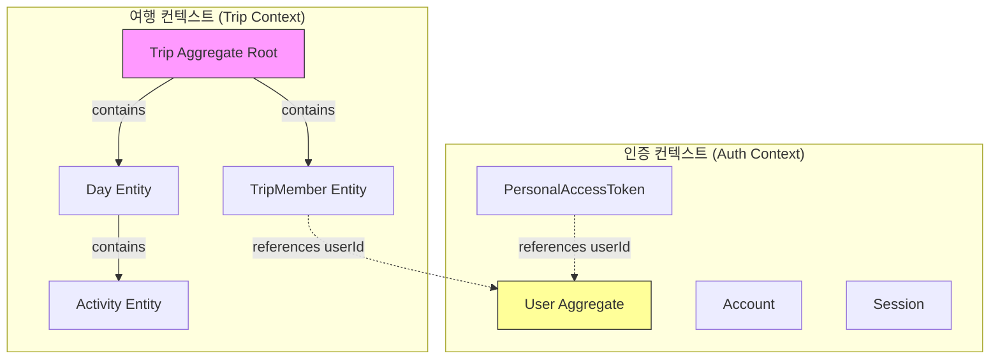
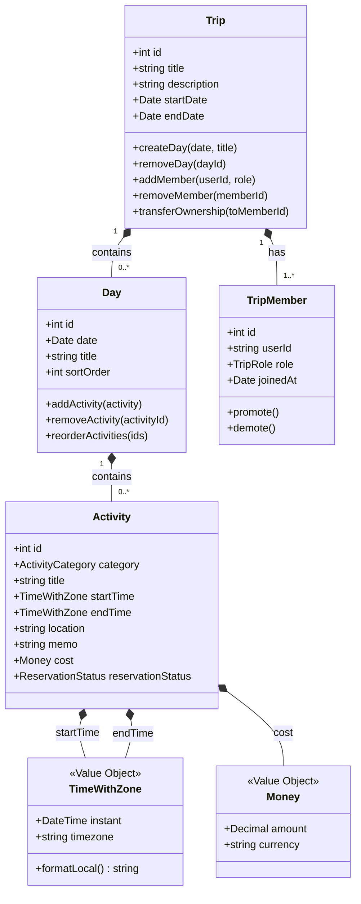
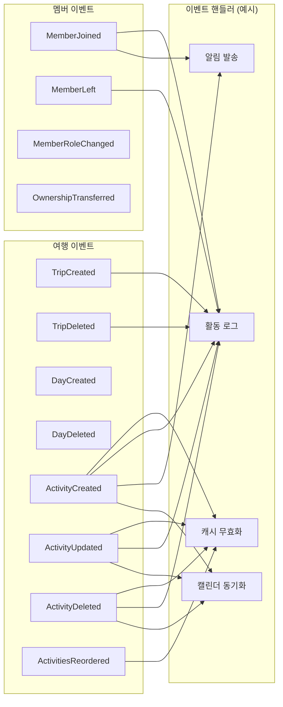
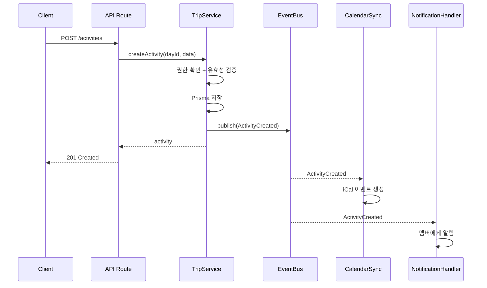

# 도메인 모델

DDD + 이벤트 드리븐 관점의 도메인 설계. 용어는 `specs/004-fullstack-transition/spec.md` Glossary 기준.

## 바운디드 컨텍스트



**2개 컨텍스트:**
- **여행 컨텍스트**: Trip이 루트. Day, Activity, TripMember를 포함. 비즈니스 핵심
- **인증 컨텍스트**: Auth.js v5 관리 영역. User, Account, Session, PAT. 여행 컨텍스트와 userId로만 연결

## 용어 사전 (specs/004 기준)

| 한글 | 영문 | 정의 |
|------|------|------|
| 여행 | Trip | 최상위 단위. 제목, 기간, 일정 포함 |
| 일정 | Day | 일별 일정. 여행에 속하며 날짜, 활동 포함 |
| 활동 | Activity | 일정 내 구조화된 항목 (관광, 식사, 이동 등) |
| 멤버 | TripMember | 여행 참여자. 역할(주인/호스트/게스트) 포함 |
| 주인 | OWNER | 여행 생성자. 여행당 1명. 양도 가능. 전체 권한 |
| 호스트 | HOST | 함께 기획하는 동행자. 편집 + 초대 가능 |
| 게스트 | GUEST | 조회만 가능한 동행자 |
| 초대 | Invite | JWT 토큰 기반 링크. 별도 테이블 없음 |

## 애그리거트

### Trip Aggregate Root (여행)

여행 일정의 핵심. Day, Activity, TripMember를 포함하는 루트 애그리거트.



### 권한 매트릭스

| 행위 | OWNER | HOST | GUEST |
|------|-------|------|-------|
| 여행 조회 | O | O | O |
| 일정/활동 편집 | O | O | X |
| 멤버 초대 | O | O | X |
| 멤버 제거 | O (호스트 포함) | O (게스트만) | X |
| 호스트 승격/강등 | O | X | X |
| 여행 삭제 | O | X | X |
| 주인 양도 | O (→HOST) | X | X |

## 밸류 오브젝트

| VO | 구성 | 설명 |
|----|------|------|
| **TimeWithZone** | instant (Timestamptz) + timezone (IANA) | 시각 + 표시 시간대. timezone NULL이면 Day 도시 기준 |
| **Money** | amount (Decimal) + currency (VARCHAR) | 비용 + ISO 4217 통화 코드 |
| **ActivityCategory** | enum | SIGHTSEEING, DINING, TRANSPORT, ACCOMMODATION, SHOPPING, OTHER |
| **ReservationStatus** | enum | REQUIRED, RECOMMENDED, ON_SITE, NOT_NEEDED |
| **TripRole** | enum | OWNER, HOST, GUEST |

## 도메인 이벤트

현재는 이벤트 없이 직접 호출. 이벤트 드리븐 전환 시 아래 이벤트 도입.



### 이벤트 흐름 예시: 활동 생성



## 현재 → 목표 구조 비교

| 항목 | 현재 | 목표 (DDD + 이벤트 드리븐) |
|------|------|--------------------------|
| **비즈니스 로직** | API Route에 혼재 | Service 계층 분리 |
| **데이터 접근** | Route → Prisma 직접 | Service → Repository → Prisma |
| **도메인 행위** | 없음 (CRUD만) | 애그리거트 메서드 (e.g. `day.addActivity()`) |
| **멤버 관리** | Route에서 직접 역할 체크 | Trip 애그리거트가 멤버 행위 캡슐화 |
| **삭제 전파** | DB FK Cascade | 도메인 이벤트 → 핸들러 |
| **부가 작업** | 불가 | 이벤트 핸들러로 확장 (로그, 알림, 캐시) |
| **테스트** | Prisma mock 필수 | 서비스 단위 테스트 가능 |

## 레이어 구조 (목표)

```
src/
├── domain/              # 도메인 모델 (순수 TypeScript, 프레임워크 무관)
│   ├── trip/
│   │   ├── trip.ts            # Trip 애그리거트 (Day, Activity, TripMember 포함)
│   │   ├── day.ts             # Day 엔티티
│   │   ├── activity.ts        # Activity 엔티티
│   │   ├── trip-member.ts     # TripMember 엔티티
│   │   ├── value-objects.ts   # TimeWithZone, Money 등
│   │   └── events.ts          # TripCreated, ActivityCreated 등
│   └── auth/
│       └── (Auth.js 관리 — 별도 도메인 모델 없음)
├── application/         # 유스케이스 (서비스 계층)
│   ├── trip-service.ts
│   ├── activity-service.ts
│   └── member-service.ts
├── infrastructure/      # 인프라 (Prisma, 이벤트 버스)
│   ├── repositories/
│   │   └── prisma-trip-repository.ts
│   └── events/
│       └── event-bus.ts
└── app/                 # Next.js (프레젠테이션 계층)
    └── api/             # 얇은 라우트 핸들러 (서비스 위임)
```
