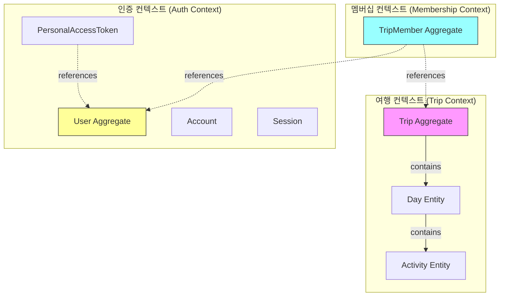
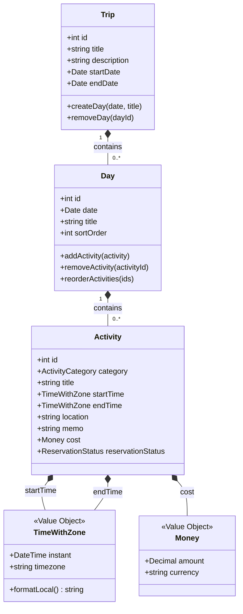
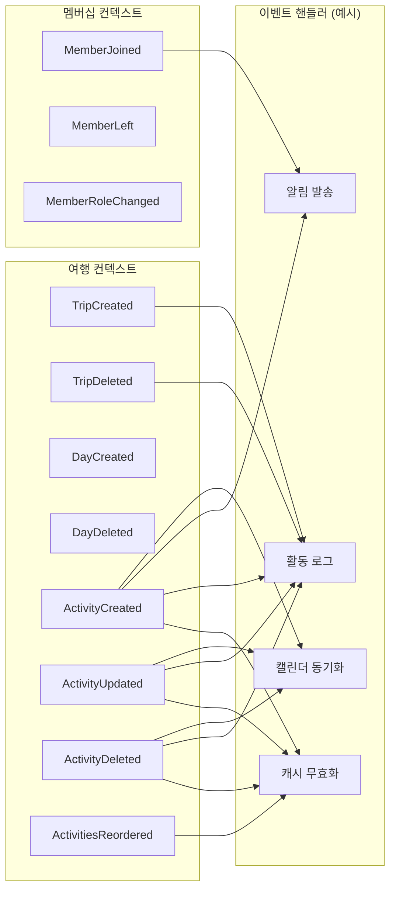
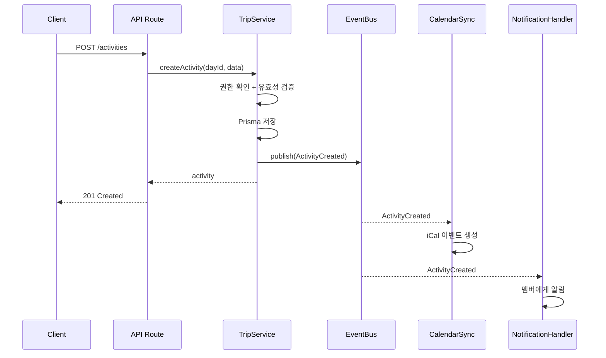

# 도메인 모델

DDD + 이벤트 드리븐 관점의 도메인 설계.

## 바운디드 컨텍스트



## 애그리거트

### Trip Aggregate (여행)

여행 일정의 핵심. Day와 Activity를 포함하는 루트 애그리거트.



### TripMember Aggregate (멤버십)

여행 접근 권한 관리. Trip과 User를 연결하지만 독립 애그리거트.

| 역할 | 권한 |
|------|------|
| OWNER | 전체 (삭제, 멤버 관리) |
| HOST | 편집 (일정, 활동 CRUD) |
| GUEST | 조회만 |

### User Aggregate (인증)

Auth.js v5 관리 영역. 비즈니스 도메인과 분리.

## 밸류 오브젝트

| VO | 구성 | 설명 |
|----|------|------|
| **TimeWithZone** | instant (Timestamptz) + timezone (IANA) | 시각 + 표시 시간대. timezone이 null이면 Day 도시 기준 |
| **Money** | amount (Decimal) + currency (VARCHAR) | 비용. 통화 코드 포함 |
| **ActivityCategory** | enum | SIGHTSEEING, DINING, TRANSPORT, ACCOMMODATION, SHOPPING, OTHER |
| **ReservationStatus** | enum | REQUIRED, RECOMMENDED, ON_SITE, NOT_NEEDED |
| **TripRole** | enum | OWNER, HOST, GUEST |

## 도메인 이벤트

현재는 이벤트 없이 직접 호출. 이벤트 드리븐 전환 시 아래 이벤트 도입.



### 이벤트 흐름 예시: 활동 생성



## 현재 → 목표 구조 비교

| 항목 | 현재 | 목표 (DDD + 이벤트 드리븐) |
|------|------|--------------------------|
| **비즈니스 로직** | API Route에 혼재 | Service 계층 분리 |
| **데이터 접근** | Route → Prisma 직접 | Service → Repository → Prisma |
| **도메인 행위** | 없음 (CRUD만) | 애그리거트 메서드 (e.g. `day.addActivity()`) |
| **삭제 전파** | DB FK Cascade | 도메인 이벤트 → 핸들러 |
| **부가 작업** | 불가 | 이벤트 핸들러로 확장 (로그, 알림, 캐시) |
| **테스트** | Prisma mock 필수 | 서비스 단위 테스트 가능 |
| **컨텍스트 간 통신** | Prisma JOIN | 이벤트 또는 인터페이스 |

## 레이어 구조 (목표)

```
src/
├── domain/              # 도메인 모델 (순수 TypeScript, 프레임워크 무관)
│   ├── trip/
│   │   ├── trip.ts            # Trip 애그리거트
│   │   ├── day.ts             # Day 엔티티
│   │   ├── activity.ts        # Activity 엔티티
│   │   ├── value-objects.ts   # TimeWithZone, Money 등
│   │   └── events.ts          # TripCreated, ActivityCreated 등
│   └── membership/
│       ├── trip-member.ts     # TripMember 애그리거트
│       └── events.ts          # MemberJoined, MemberLeft 등
├── application/         # 유스케이스 (서비스 계층)
│   ├── trip-service.ts
│   ├── activity-service.ts
│   └── member-service.ts
├── infrastructure/      # 인프라 (Prisma, 이벤트 버스)
│   ├── repositories/
│   │   ├── prisma-trip-repository.ts
│   │   └── prisma-member-repository.ts
│   └── events/
│       └── event-bus.ts
└── app/                 # Next.js (프레젠테이션 계층)
    └── api/             # 얇은 라우트 핸들러 (서비스 위임)
```
