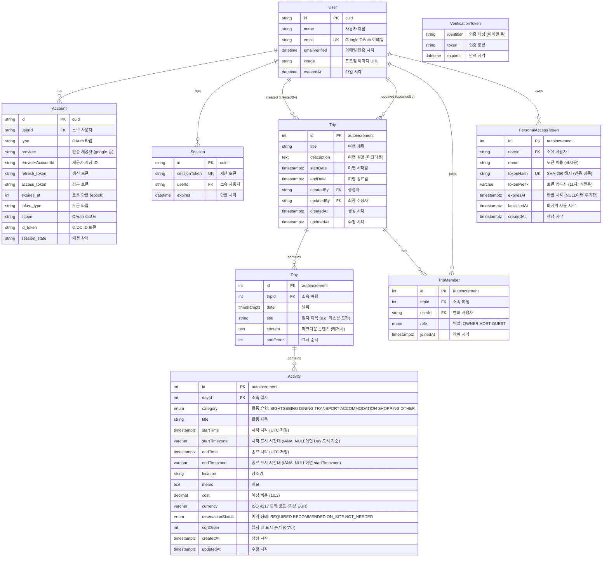

# ERD (Entity-Relationship Diagram)

> **대상 독자**: 기여자·개발자 — 데이터 모델·관계·인덱스를 확인하려는 분.

Prisma 스키마 기준. `prisma/schema.prisma` 참조.

## 설계 결정

### Activity 시간대 (startTimezone / endTimezone)

- **Timestamptz**는 절대 시각(UTC)을 저장하지만 표시 시간대 정보는 유실됨
- IANA timezone 컬럼으로 원래 표시 시간대를 보존
- 국제 이동(항공편)에서 출발/도착 시간대가 다른 경우 정확한 표시 가능
- nullable: 대부분 활동은 Day 도시 시간대와 동일하므로 생략 가능
- 예: `startTimezone: "Asia/Seoul"` → 표시: `13:00 KST`
