# ERD (Entity-Relationship Diagram)

> **대상 독자**: 기여자·개발자 — 데이터 모델·관계·인덱스를 확인하려는 분.

Prisma 스키마 기준. `prisma/schema.prisma` 참조.

```mermaid
erDiagram
    User {
        string id PK "cuid"
        string name "사용자 이름"
        string email UK "Google OAuth 이메일"
        datetime emailVerified "이메일 인증 시각"
        string image "프로필 이미지 URL"
        datetime createdAt "가입 시각"
    }

    Account {
        string id PK "cuid"
        string userId FK "소속 사용자"
        string type "OAuth 타입"
        string provider "인증 제공자 (google 등)"
        string providerAccountId "제공자 계정 ID"
        string refresh_token "갱신 토큰"
        string access_token "접근 토큰"
        int expires_at "토큰 만료 (epoch)"
        string token_type "토큰 타입"
        string scope "OAuth 스코프"
        string id_token "OIDC ID 토큰"
        string session_state "세션 상태"
    }

    Session {
        string id PK "cuid"
        string sessionToken UK "세션 토큰"
        string userId FK "소속 사용자"
        datetime expires "만료 시각"
    }

    VerificationToken {
        string identifier "인증 대상 (이메일 등)"
        string token "인증 토큰"
        datetime expires "만료 시각"
    }

    Trip {
        int id PK "autoincrement"
        string title "여행 제목"
        text description "여행 설명 (마크다운)"
        string createdBy FK "생성자"
        string updatedBy FK "최종 수정자"
        timestamptz createdAt "생성 시각"
        timestamptz updatedAt "수정 시각"
    }

    Day {
        int id PK "autoincrement"
        int tripId FK "소속 여행"
        timestamptz date "날짜 (Trip 범위 자동 확장)"
        string title "일자 제목 (e.g. 리스본 도착)"
        text content "마크다운 콘텐츠 (레거시)"
    }

    Activity {
        int id PK "autoincrement"
        int dayId FK "소속 일자"
        enum category "활동 유형: SIGHTSEEING DINING TRANSPORT ACCOMMODATION SHOPPING OTHER"
        string title "활동 제목"
        timestamptz startTime "시작 시각 (UTC 저장)"
        varchar startTimezone "시작 표시 시간대 (IANA, NULL이면 Day 도시 기준)"
        timestamptz endTime "종료 시각 (UTC 저장)"
        varchar endTimezone "종료 표시 시간대 (IANA, NULL이면 startTimezone)"
        string location "장소명"
        text memo "메모"
        text url "참고 링크 (예약·정보 페이지, nullable)"
        decimal cost "예상 비용 (10,2)"
        varchar currency "ISO 4217 통화 코드 (기본 EUR)"
        enum paymentTiming "지출 시점: ADVANCE(사전) ON_SITE(현장, 기본값)"
        boolean allDay "종일 일정 여부 (is_all_day, 기본 false)"
        int sortOrder "일자 내 표시 순서 (0부터)"
        timestamptz createdAt "생성 시각"
        timestamptz updatedAt "수정 시각"
    }

    TripMember {
        int id PK "autoincrement"
        int tripId FK "소속 여행"
        string userId FK "멤버 사용자"
        enum role "역할: OWNER HOST GUEST"
        timestamptz joinedAt "참여 시각"
    }

    PersonalAccessToken {
        int id PK "autoincrement"
        string userId FK "소유 사용자"
        string name "토큰 이름 (표시용)"
        string tokenHash UK "SHA-256 해시 (인증 검증)"
        varchar tokenPrefix "토큰 접두사 (11자, 식별용)"
        timestamptz expiresAt "만료 시각 (NULL이면 무기한)"
        timestamptz lastUsedAt "마지막 사용 시각"
        timestamptz createdAt "생성 시각"
    }

    TripCalendarLink {
        int id PK "autoincrement"
        int tripId FK,UK "여행당 1개 (v2.9.0+ 정본)"
        string ownerId FK "공유 캘린더 소유 주인"
        enum provider "캘린더 제공자: GOOGLE(기본) APPLE (spec 024)"
        string calendarId "외부 캘린더 ID"
        string calendarName "표시 이름"
        timestamptz lastSyncedAt "최근 동기화 시각"
        string lastError "최근 동기화 오류"
        int skippedCount "사용자 직접 수정으로 건너뛴 이벤트 수"
    }

    TripCalendarEventMapping {
        int id PK "autoincrement"
        int tripCalendarLinkId FK "소속 공유 캘린더 (v2.10.0+ 매핑 정본)"
        int activityId FK "원천 활동"
        string googleEventId "외부 이벤트 ID"
        string syncedEtag "최근 동기화 ETag"
        timestamptz lastSyncedAt "최근 동기화 시각"
    }

    MemberCalendarSubscription {
        int id PK "autoincrement"
        int linkId FK "소속 공유 캘린더"
        string userId FK "구독 동행자"
        enum status "옵트인 상태: NOT_ADDED ADDED ERROR"
        string lastError "최근 오류"
    }

    GCalLink {
        int id PK "autoincrement"
        string userId FK "per-user (레거시 v2.8.0)"
        int tripId FK "소속 여행"
        enum provider "캘린더 제공자: GOOGLE(기본) APPLE"
        string calendarId "외부 캘린더 ID"
        enum calendarType "DEDICATED PRIMARY"
        string calendarName "표시 이름"
        timestamptz lastSyncedAt "최근 동기화 시각"
    }

    GCalEventMapping {
        int id PK "autoincrement"
        int linkId FK "per-user 레거시 매핑"
        int activityId FK "원천 활동"
        string googleEventId "외부 이벤트 ID"
        string syncedEtag "최근 동기화 ETag"
    }

    AppleCalendarCredential {
        string userId PK,FK "소유 사용자 (1:1)"
        string appleId "Apple ID"
        string encryptedPassword "AES-256-GCM 암호화 app password"
        string iv "암호화 IV (base64, 12바이트)"
        timestamptz lastValidatedAt "최근 검증 시각"
        string lastError "최근 오류"
    }

    ImportRun {
        int id PK "autoincrement"
        int tripId FK "소속 여행"
        string triggeredByUserId FK "실행 사용자"
        enum provider "출처: GOOGLE APPLE"
        string externalCalendarId "외부 캘린더 ID"
        int importedCount "가져온 수"
        int skippedCount "건너뛴 수"
        int failedCount "실패 수"
        array failedTitles "실패 제목 목록"
        timestamptz startedAt "시작 시각"
        timestamptz finishedAt "종료 시각"
    }

    ActivityDraft {
        int id PK "autoincrement"
        int tripId FK "소속 여행"
        int dayId FK "배치 일자 (nullable)"
        int importRunId FK "소속 가져오기 실행"
        enum provider "출처: GOOGLE APPLE"
        string externalCalendarId "외부 캘린더 ID"
        string externalEventId "외부 이벤트 ID"
        string title "제목 (외부 자동 채움)"
        timestamptz startTime "시작 (외부 자동)"
        timestamptz endTime "종료 (외부 자동)"
        boolean isAllDay "종일 여부"
        string locationText "장소 텍스트"
        text description "설명"
        varchar startTimezone "시작 표시 시간대 (사용자 보강)"
        varchar endTimezone "종료 표시 시간대 (사용자 보강)"
        enum status "PENDING PROMOTED DELETED"
        int promotedToActivityId FK,UK "승격된 활동 (nullable)"
        timestamptz lastRefreshedAt "최근 갱신 시각"
    }

    ExchangeRate {
        int id PK "autoincrement"
        date date "환율 일자"
        varchar base "기준 통화 (ISO 4217)"
        decimal rateToKrw "현지 1단위 = 원화 N (18,6)"
        timestamptz fetchedAt "확보 시각"
    }

    DeviceAuthorizationRequest {
        string id PK "cuid"
        string deviceCodeHash UK "디바이스 코드 해시"
        string userCode UK "사용자 코드"
        enum status "PENDING APPROVED DENIED"
        string userId FK "승인 사용자 (nullable)"
        timestamptz expiresAt "만료 시각"
        int interval "폴링 간격(초, 기본 5)"
        timestamptz lastPolledAt "최근 폴링 시각"
        timestamptz createdAt "생성 시각"
    }

    User ||--o{ Account : "has"
    User ||--o{ Session : "has"
    User ||--o{ Trip : "created (createdBy)"
    User ||--o{ Trip : "updated (updatedBy)"
    User ||--o{ TripMember : "joins"
    User ||--o{ PersonalAccessToken : "owns"
    Trip ||--o{ Day : "contains"
    Trip ||--o{ TripMember : "has"
    Day ||--o{ Activity : "contains"
    Trip ||--o| TripCalendarLink : "shares (v2.9.0+)"
    User ||--o{ TripCalendarLink : "owns (ownerId)"
    TripCalendarLink ||--o{ TripCalendarEventMapping : "maps"
    Activity ||--o{ TripCalendarEventMapping : "exported as"
    TripCalendarLink ||--o{ MemberCalendarSubscription : "subscribed by"
    User ||--o{ MemberCalendarSubscription : "opts in"
    Trip ||--o{ GCalLink : "legacy per-user"
    User ||--o{ GCalLink : "legacy per-user"
    GCalLink ||--o{ GCalEventMapping : "legacy maps"
    Activity ||--o{ GCalEventMapping : "legacy exported as"
    User ||--o| AppleCalendarCredential : "stores (1:1)"
    Trip ||--o{ ImportRun : "imported into"
    User ||--o{ ImportRun : "triggers"
    ImportRun ||--o{ ActivityDraft : "produces"
    Trip ||--o{ ActivityDraft : "staged in"
    Day ||--o{ ActivityDraft : "placed on (nullable)"
    Activity ||--o| ActivityDraft : "promoted from"
    User ||--o{ DeviceAuthorizationRequest : "approves"
```

> `ExchangeRate`는 다른 엔티티와 FK 관계가 없는 독립 캐시 테이블이다 — `(date, base)`당 한 줄로 원화 근사 시세를 저장한다(spec 062).

## 설계 결정

### Activity 시간대 (startTimezone / endTimezone)

- **Timestamptz**는 절대 시각(UTC)을 저장하지만 표시 시간대 정보는 유실됨
- IANA timezone 컬럼으로 원래 표시 시간대를 보존
- 국제 이동(항공편)에서 출발/도착 시간대가 다른 경우 정확한 표시 가능
- nullable: 대부분 활동은 Day 도시 시간대와 동일하므로 생략 가능
- 예: `startTimezone: "Asia/Seoul"` → 표시: `13:00 KST`

### 여행 기간 (derived) 및 일자 번호

- **Trip은 `startDate`/`endDate` 컬럼을 가지지 않는다** (spec 029 T051, v3.0.0 contract 단계에서 DROP). 시작·종료일은 등록된 Day의 min/max date에서 파생한다 — `src/lib/trip-period.ts::getDerivedPeriod`
- Day는 `sortOrder` 컬럼을 가지지 않는다 (v2.7.1에서 DROP)
- "DAY 1, DAY 2…" 표시는 `(date - 최소 Day date) + 1`로 파생
- `(tripId, date)` 유니크 제약으로 같은 날짜 중복 차단
- v1 API(`/api/trips/...`)는 응답에 `sortOrder`를 동적 부착해 MCP 호환 유지

### 캘린더 모델 이원화 (v2.9.0~v2.10.0)

여행 캘린더 모델은 v2.9.0에서 **per-user → per-trip 공유** 방식으로 재설계됨. 무중단을 위해 두 모델이 병존한다.

| 정본 여부 | 모델 | 도입 | 역할 |
|---|---|---|---|
| **정본** | `TripCalendarLink` | v2.9.0 | 여행당 1개. 주인이 외부에 공유 캘린더를 만들고 ACL로 동행자에게 권한 부여 |
| **정본** | `TripCalendarEventMapping` | v2.10.0 | 활동 ↔ 외부 이벤트 매핑. spec 022에서 공유 캘린더 귀속으로 재설계 |
| **정본** | `MemberCalendarSubscription` | v2.9.0 | 동행자가 본인 외부 UI에 추가했는지 여부(옵트인) |
| 레거시 | `GCalLink` | v2.8.0 | per-user 캘린더. v2.9.0 이후 신규 쓰기 없음 |
| 레거시 | `GCalEventMapping` | v2.8.0 | per-user 매핑. v2.10.0에서 410 Gone 라우트로 전환 |

레거시 두 테이블의 DROP은 후속 릴리즈(v2.11.0+)에서 contract 단계로 진행. 자세한 정책은 [ADR-0003 per-trip-shared-calendar](./adr/0003-per-trip-shared-calendar.md) 참조.

### 캘린더 제공자 추상화 (CalendarProviderId)

- `GCalLink`·`TripCalendarLink`·`ActivityDraft`·`ImportRun`이 `provider` 컬럼(`GOOGLE`/`APPLE`, 기본 `GOOGLE`)을 공유한다 (spec 024 expand)
- Apple iCloud는 CalDAV로 연동하며, app-specific password를 `AppleCalendarCredential`에 AES-256-GCM으로 암호화해 user당 1건 저장한다 (spec 025)

### 외부 캘린더 가져오기 (ActivityDraft / ImportRun)

외부 캘린더(Google·Apple) 이벤트를 **외부 → 내부 단방향**으로 가져오는 staging 영역 (spec 027, ADR-0006, v2.15.0).

- `ImportRun`: 한 번의 가져오기 실행 기록(가져옴·건너뜀·실패 카운트)
- `ActivityDraft`: 가져온 이벤트 초안. 사용자가 검토 후 `promote`하면 `Activity`로 승격되고 `promotedToActivityId`로 연결된다. `(provider, externalCalendarId, externalEventId)` 유니크로 중복 가져오기를 차단
- trip 캘린더 정본(ADR-0003)은 그대로 유지 — 가져오기는 정본을 건드리지 않는다

### 헤드리스 인증 (DeviceAuthorizationRequest)

- AI 에이전트·CLI가 브라우저 없이 인증하는 Device Authorization Grant 상태 (spec 060)
- 승인(브라우저)과 폴링(에이전트) 두 요청이 공유하는 단명 레코드. 승인·만료로 소비되면 삭제되며 raw 토큰은 보관하지 않는다(승인 후 폴링 시 PAT 발급)

### 원화 근사 환산 캐시 (ExchangeRate)

- 일자·기준통화별 원화 근사 시세를 `(date, base)`당 한 줄로 캐시 (spec 062)
- 여행자가 편집하지 않는 표시 보조 데이터 — 활동·금액 정본과 무관. 외부 환율 API(Frankfurter, ECB 기반)에서 자동 확보한다
