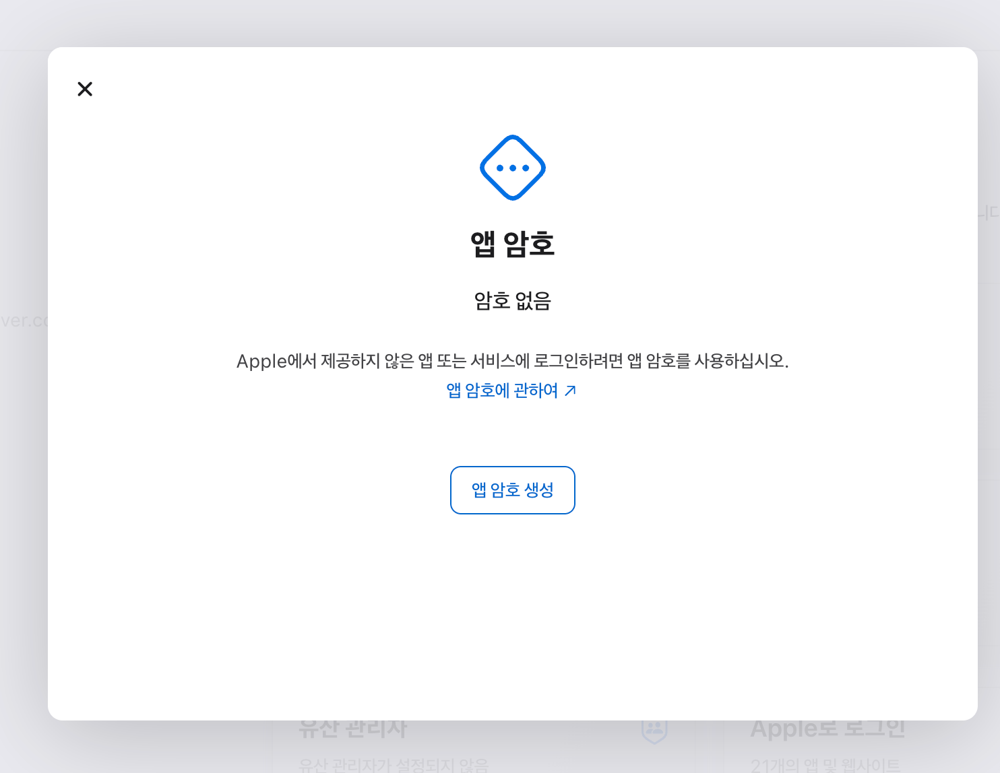
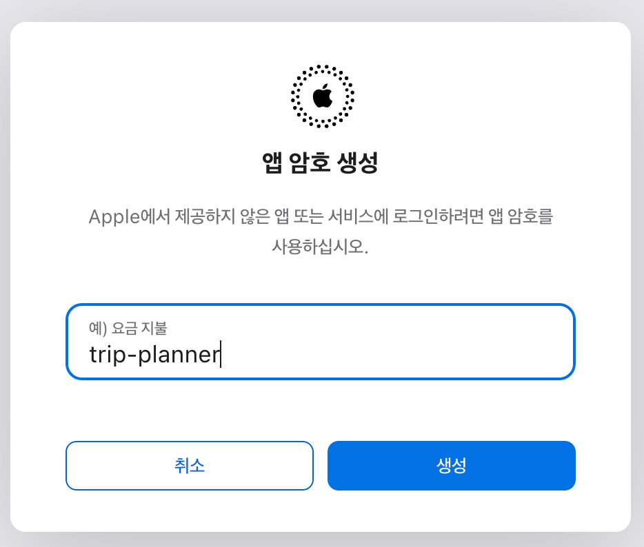
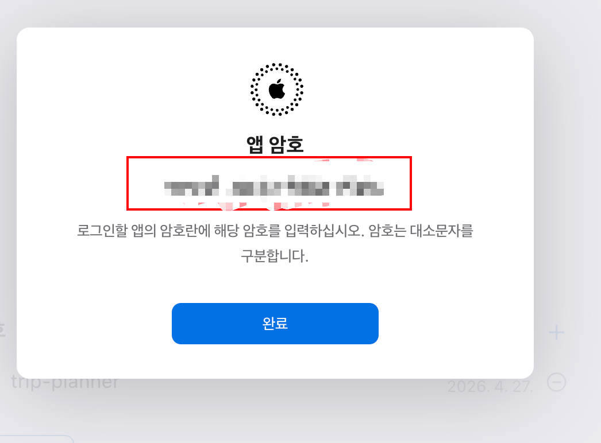

# Apple 앱 암호 발급 가이드 (trip-planner Apple 캘린더 연동용)

**대상 독자**: trip-planner의 Apple 캘린더 연동을 처음 켜는 일반 사용자
**위치**: 본 문서는 POC([#345](https://github.com/idean3885/trip-planner/issues/345)) 산출물이며, 후속 정식 피처(`apple-caldav-provider`)의 위자드 UI 콘텐츠 기준이 된다.
**상태**: Draft (캡쳐 채움 대기)

> **왜 이 단계가 필요한가**
> Apple은 다른 앱이 사용자 캘린더에 접근하는 표준 방법(Google의 OAuth 같은)을 제공하지 않습니다. 대신 **앱 암호**라는 16자리 일회성 자격증명을 사용자가 직접 발급해서 trip-planner에 입력하는 방식만 가능합니다. 다른 길은 없습니다 — Apple 정책입니다.
>
> trip-planner는 입력받은 앱 암호로 **사용자의 iCloud 캘린더에만** 접근하며(읽기/이벤트 생성/수정/삭제), Apple ID의 다른 정보(메일·연락처 등)는 건드리지 않습니다. 단, 앱 암호 자체는 권한 범위가 분리되지 않으므로 **신뢰할 수 있는 서비스에만** 입력하시기 바랍니다.

---

## 사전 조건

다음 중 **하나 이상** 충족되어 있어야 "앱 암호" 메뉴가 노출됩니다:

- ✅ Apple ID에 **2단계 인증(2FA)** 활성화
- ✅ Apple ID에 **패스키** 등록 (패스키 사용 시 2FA 자동 활성)

확인 방법: https://appleid.apple.com 로그인 → "로그인 및 보안" → "앱 암호" 메뉴가 보이면 충족.

> 메뉴가 보이지 않으면 같은 페이지에서 "2단계 인증" 또는 "패스키"를 먼저 활성화하세요.

---

## Step 1 — Apple ID 사이트 로그인

1. 브라우저에서 https://appleid.apple.com 접속
2. 사용 중인 Apple ID로 로그인 (2FA 코드 입력)

> **캡쳐 가이드**: Apple ID 로그인 화면. Apple ID 입력란 일부는 마스킹.

---

## Step 2 — "로그인 및 보안" 진입

좌측 메뉴 또는 상단 카드에서 **"로그인 및 보안"**을 선택합니다.

> **캡쳐 가이드**: "로그인 및 보안" 메뉴 위치가 보이는 전체 화면.

---

## Step 3 — "앱 암호" 메뉴 열기

"로그인 및 보안" 안에서 **"앱 암호"**를 클릭합니다.

> **캡쳐 가이드**: "앱 암호" 메뉴 항목이 강조된 상태 (호버 또는 빨간 박스).

---

## Step 4 — "앱 암호 생성" 클릭

다이얼로그가 열리면 **"앱 암호 생성"** 버튼을 클릭합니다.

> **캡쳐 가이드**: "암호 없음" + "앱 암호 생성" 버튼이 보이는 다이얼로그 전체.

---

## Step 5 — 라벨 입력

암호의 용도를 기억하기 위한 **라벨**을 입력합니다. 권장값: `trip-planner`

> **캡쳐 가이드**: 라벨 입력란에 `trip-planner`가 입력된 상태.

---

## Step 6 — 16자리 암호 표시 (⚠️ 즉시 복사)

`xxxx-xxxx-xxxx-xxxx` 형식의 16자리 암호가 표시됩니다.

> ⚠️ **이 암호는 이 화면을 닫으면 다시 볼 수 없습니다.** 즉시 복사해서 trip-planner에 붙여넣으세요. 닫고 나서 잊어버렸다면 같은 라벨을 폐기하고 다시 발급해야 합니다.

> **캡쳐 가이드**: 16자리 암호 화면. **암호 자체는 반드시 마스킹**(예: `xxxx-xxxx-xxxx-xxxx`로 덮기). 라벨과 "확인" 버튼만 노출.

---

## Step 7 — trip-planner에 입력

복사한 16자리 암호를 trip-planner의 Apple 캘린더 연동 화면에 붙여넣습니다.

> POC 단계에서는 위자드 UI가 아직 없습니다. `spike/apple-caldav/.env.local`의 `APPLE_APP_PASSWORD=`에 붙여넣으세요. (정식 피처 구현 후에는 위자드의 입력란에 붙여넣게 됩니다.)

> **캡쳐 가이드**: (POC 단계에서는) `.env.local` 편집 화면 또는 (정식 위자드 후에는) 위자드 입력 화면. 둘 다 16자리 부분은 마스킹.

---

## (POC 종료 후) 앱 암호 폐기

POC를 마치면 같은 화면에서 발급한 `trip-planner` 라벨의 암호를 폐기 권장합니다.

1. https://appleid.apple.com → "로그인 및 보안" → "앱 암호"
2. 발급된 라벨 옆 휴지통 아이콘 → 삭제

폐기하면 즉시 trip-planner의 캘린더 연동이 끊어집니다(401 응답). 정식 운영 시점에는 trip-planner UI가 401을 감지해 사용자에게 재입력을 안내합니다.

---

## 캡쳐 파일 가이드

본 가이드의 캡쳐 7장은 `docs/research/apple-caldav-screenshots/` 디렉토리에 저장합니다.

| 파일명 | 캡쳐 영역 | 마스킹 필요 |
|---|---|---|
| `step-1-login.png` | Apple ID 로그인 화면 | Apple ID 입력란 일부(앞 3자만 노출, 나머지 ⬛) |
| `step-2-security.png` | "로그인 및 보안" 메뉴 위치 | 없음 |
| `step-3-app-passwords.png` | "앱 암호" 메뉴 항목 강조 | 없음 |
| `step-4-create-button.png` | "암호 없음" + "앱 암호 생성" 다이얼로그 | 없음 |
| `step-5-label.png` | 라벨 입력란에 `trip-planner` | 없음 |
| `step-6-password.png` | 16자리 암호 표시 | **암호 자체 반드시 마스킹** |
| `step-7-paste.png` | trip-planner 입력 (POC: `.env.local`, 정식: 위자드) | 16자리 부분 마스킹 |

### 권장 형식

- **포맷**: PNG (Apple 사이트 한국어 UI 그대로)
- **해상도**: 본문 너비 기준 1280~1600px (Retina 캡쳐 시 2x)
- **마스킹 도구**: macOS 미리보기 → 사각형 도구로 검정 박스. 또는 Cmd+Shift+5 캡쳐 직후 마크업으로 처리.
- **PII**: Apple ID 전체 노출 금지. `dykim****@gmail.com` 정도로 가림.

### 권장 캡쳐 순서

1. Apple ID 로그인 (Step 1) — 다른 탭에서 미리 로그아웃 후 시작하면 자연스러운 화면
2. Step 2~5는 한 세션에서 연속 캡쳐
3. Step 6은 캡쳐 직후 즉시 마스킹 (실제 암호가 캡쳐에 남으면 안 됨)
4. Step 7은 POC 단계에선 `.env.local` 편집기 화면, 정식 피처 구현 후 위자드 화면으로 교체

---

## 변경 이력

- 2026-04-27 — 초안 작성 (캡쳐 placeholder만, 본 사용자 캡쳐 채움 대기).
