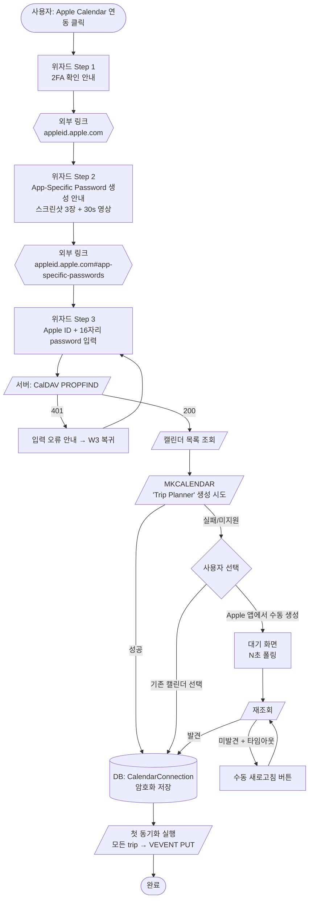

# Apple iCloud CalDAV POC — 측정 결과 + 확정 플로우

**상태**: Draft (측정 진행 중)
**이슈**: [#345](https://github.com/idean3885/trip-planner/issues/345)
**spike**: `spike/apple-caldav-poc` 브랜치 (제품 코드 반영 금지, reference only)
**작성**: 2026-04-27

## 목적

Apple iCloud CalDAV를 trip-planner의 두 번째 캘린더 provider로 도입하기 전, **제약 사항이 많은 연동 플로우를 실제 사용감으로 확정**한다. 본 문서가 후속 정식 피처 스펙(`calendar-provider-abstraction`, `apple-caldav-provider`)의 기준이 된다.

## 배경

- Google Calendar는 OAuth 심사 제약(Testing 100명 cap, sensitive/restricted CASA 연 $500~$4.5k)으로 확장성 한계 — [ADR-0004](../adr/0004-gcal-testing-mode-cost.md) 참조
- Apple은 CalDAV용 OAuth 미제공 → **app-specific password + Basic Auth**만 가능
- 수동 단계(2FA, app-password 생성)는 **Apple 정책상 원천적으로 불가피** → 자동화의 경계가 결정 포인트
- 방향: Google 연동은 Testing 유지, Apple CalDAV를 추가해 무심사·무제한 경로 확보

## 측정 환경

| 항목 | 값 |
|---|---|
| Endpoint | `https://caldav.icloud.com` |
| 라이브러리 | [`tsdav` 2.1.8](https://github.com/natelindev/tsdav) |
| 인증 | Basic (Apple ID + 16자리 app-specific password) |
| 측정자 | (사용자) |
| 측정일 | (예정) |
| Apple ID | (마스킹 — 결과 JSON에는 평문 저장 안 됨) |

## 검증 매트릭스 결과

> 자동 측정은 `spike/apple-caldav/matrix.ts` 실행 결과(`results/<run-label>.json`)에서 가져온다. #4·#9·#10는 수동/문서 보강.

| # | 항목 | 기대 | 실측 | 판정 |
|---|---|---|---|---|
| 1 | PROPFIND 인증 검증 응답 시간 | <2s | _(pending)_ | _(pending)_ |
| 2 | 기존 캘린더 목록 조회 (한국어 이름·공유 포함) | 전체 정확 반환 | _(pending)_ | _(pending)_ |
| 3 | **MKCALENDAR 신규 생성** | 불확실 (iCloud 미지원 가능성 높음) | _(pending)_ | _(pending)_ |
| 4 | Apple 캘린더 앱 수동 생성 → iCloud 반영 지연 | ? | _(pending — 수동 측정)_ | _(pending)_ |
| 5 | VEVENT PUT (생성) | 201/204 + 즉시 반영 | _(pending)_ | _(pending)_ |
| 6 | VEVENT PUT (update, If-Match ETag) | 204 | _(pending)_ | _(pending)_ |
| 7 | VEVENT DELETE | 204 | _(pending)_ | _(pending)_ |
| 8 | 잘못된 app-password | 401 즉시 | _(pending)_ | _(pending)_ |
| 9 | 2FA 미설정 Apple ID | app-password 발급 자체 불가 | Apple 정책 — 발급 화면 노출 안 됨 | UX: 사전 안내 문구로 차단 |
| 10 | app-password 만료/재발급 주기 | ? | Apple 공식: 자연 만료 없음. Apple ID 비밀번호 변경 시만 일괄 무효화 | 재인증 트리거: 비밀번호 변경 감지 또는 401 발생 시 |

## 확정해야 할 의사결정

> 측정 후 채울 칸. v0 Mermaid의 분기를 결정한다.

### 1. MKCALENDAR 지원 여부

- **측정 #3 결과**: _(pending)_
- **결정**: _(pending — 지원 시 자동 생성, 미지원 시 "기존 캘린더 선택" 단일 경로 또는 "수동 생성 안내")_

### 2. 캘린더 선택 UX

- 후보:
  - A. 자동 생성만 (MKCALENDAR 지원 시)
  - B. 기존 선택만
  - C. 둘 다 제공 (사용자 선택)
- **결정**: _(pending — #1 결과에 종속)_

### 3. 수동 생성 후 반영 대기 UX

- 측정 #4 결과 기반:
  - 즉시 반영 → 폴링 불필요
  - 수 초 지연 → 1초 폴링 N회
  - 수십 초 지연 → "수동 새로고침" CTA
- **결정**: _(pending)_

### 4. 인증 정보 암호화 방식

- 후보:
  - A. envelope encryption (KMS 키로 데이터 키 암호화 + 데이터 키로 password 암호화)
  - B. 단일 대칭키 (KMS 직접)
  - C. AWS Secrets Manager 위임
- **고려**: 무료 티어(Vercel/Neon) 환경에서 KMS 비용·복잡도, 1인 운영 비용
- **결정**: _(pending)_

### 5. 동기화 실패 알림 채널

- 후보:
  - A. UI 배너만 (Google 연동과 동일 톤)
  - B. 이메일 (실패 누적 시)
  - C. 무음 (다음 sync 시점에 사용자가 재시도)
- **결정**: _(pending)_

## 확정 Mermaid (POC 후 교정)

> 아래는 이슈 #345의 v0 Mermaid를 그대로 옮긴 초안. 측정·결정 후 분기를 제거/추가한다.

**POC가 교정 가능성 높은 지점**:
- `TryCreate` 브랜치 (#3 결과로 제거 가능)
- `Wait` 폴링 주기 (#4 결과로 결정)
- `W3Err` 복귀 UX (에러 종류별 분기 필요 여부)

## 30초 스크린캐스트

(예정 — `spike/apple-caldav/results/wizard-<run-label>.mov` 또는 외부 링크)

## 후속 정식 피처

POC 종료 시 두 개 이슈를 신설:

1. **calendar-provider-abstraction** — Google·Apple을 동일 인터페이스로 다루는 provider 계층. 기존 GCal 코드를 abstraction에 맞춰 리팩토링하되 무중단(expand-and-contract, [ADR-0005](../adr/0005-expand-and-contract-pattern.md))
2. **apple-caldav-provider** — 본 POC 결과를 그대로 구현. 본 문서의 확정 Mermaid가 스펙의 User Scenarios 섹션 기반.

## 변경 이력

- 2026-04-27 — 초안 작성 (이슈 #345의 v0 Mermaid 복제 + 측정 결과 빈 칸).
