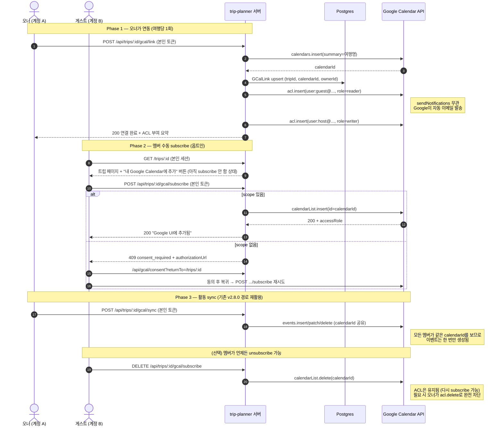

# v2.9.0 PoC — Google Calendar 공유 플로우 기술 검증

- 기간: 2026-04-21 ~ 2026-04-22
- Epic: [#349](https://github.com/idean3885/trip-planner/issues/349)
- 마일스톤: [#26 v2.9.0](https://github.com/idean3885/trip-planner/milestone/26)
- 환경: dev.trip.idean.me (Vercel preview 빌드 — develop 브랜치)
- 테스트 계정: 계정 A (오너) = `idean3885@gmail.com`, 계정 B (게스트) = `dykimdev3885@gmail.com` (둘 다 개인 Gmail, Workspace 아님)
- PoC 코드: `src/app/poc-v290/` + `src/app/api/poc/v290/` (본 PR에서 제거)

## 목적

v2.8.0 연동이 멤버마다 본인 계정에 DEDICATED 캘린더를 각각 생성 → 여행당 N개 중복. v2.9.0은 **오너 1개 공유 캘린더 + 멤버 수동 subscribe** 모델로 재설계 예정. 구현 착수 전 기술 전제 5건을 실측 검증.

## 실측 매트릭스

| # | 검증 항목 | 기대 가설 | 실측 결과 | 근거 |
|---|---|---|---|---|
| 1 | `acl.insert` 동일 scope 재호출 시 중복 여부 | 중복 생성 (non-idempotent) 가능성 | **Idempotent — same rule_id 반환, guestRuleCount=1** | run-owner-scenario 로그: `observation: same-rule-id` + acl-list |
| 2 | 게스트 토큰으로 `calendarList.insert` 성공 조건 | ACL + calendar scope 충족 시 200 | **200 + accessRole=writer** | run-guest-scenario 로그 |
| 3 | role=writer 부여 후 게스트의 `events.list` 접근 | 200 + 권한 반영 | **200, count=0** (정상) | run-guest-scenario 로그 |
| 4 | `sendNotifications:false` 이메일 억제 | Google 이메일 미발송 | **❌ 이메일 여전히 발송됨** | 양쪽 Gmail 인박스 수동 확인 (KST 09:43 공유 알림 수신) |
| 5 | `acl.patch`로 role reader→writer 변경 | 200 + newRole 반영 | **200, newRole=writer** | run-owner-scenario 마지막 step |

## 핵심 발견 요약

### ✅ 1 — ACL 재호출은 안전 (idempotent in practice)
- 동일 scope(`user:<email>`)에 대해 `acl.insert`를 반복해도 Google은 **같은 rule_id 반환**, ACL 목록에 중복 항목 없음
- 애플리케이션 레벨에서 `list-then-upsert` 사전 조회 **불필요** — 단순 `insert` 호출로 충분
- 단, role만 변경하려면 `acl.patch({ruleId: "user:<email>"})` 사용 권장 (insert로도 변경되는지 미검증 — 보수적으로 patch 사용)

### ✅ 2,3 — 공유 플로우 동작 확인
- 오너가 `acl.insert`로 ACL 부여 (서버 자동)
- 게스트가 본인 OAuth 토큰으로 `calendarList.insert` (수동 subscribe)
- `accessRole`이 `writer`로 반영, `events.list` 즉시 이용 가능
- 설계 의도(수동 subscribe + 역할별 권한)가 공식 API 조합으로 **원활히 달성**

### ❌ 4 — `sendNotifications:false`는 Gmail 간 공유에서 무시됨
- API 매개변수로 `false` 전달했음에도 구글이 공유 알림 이메일 발송
- Workspace 정책이 아닌 **Google의 자체 알림 로직** — 우리가 제어 불가
- v2.9.0 설계에 반영:
  - Google 이메일 + 우리 in-app 배너의 **이중 알림** 수용
  - 이메일 문구는 Google이 통제 (우리가 영향 없음)
  - 필요 시 in-app 알림에 "Google에서도 이메일이 갈 수 있습니다" 미니 안내

### ✅ 5 — role 동적 조정 가능
- `acl.patch`로 reader ↔ writer ↔ owner 전환 (rule_id는 `user:<email>`로 고정)
- 트립 내 멤버 role 변경(host ↔ guest)과 ACL 동기화 가능

## 추가 관찰 (v2.9.0 구현 시 별도 이슈화 필요)

### Account.scope 지속성 이상
- PoC 도중 `hasCalendarScope()`가 반복적으로 `false`로 돌아감 (run-owner-scenario 성공 직후 수 분 뒤 whoami에서 false)
- 토큰 refresh 타이밍에 `Account.scope` 필드가 비워지는 것으로 **추정**
- 재현 가능한 패턴: OAuth 재동의 → `/api/gcal/consent?returnTo=...` → 돌아오면 `scopeGranted: true`
- **조치**: v2.9.0 구현 범위에서 별도 이슈로 분리. Auth.js 토큰 이벤트 훅(`src/lib/gcal/client.ts:52`)의 업데이트 로직 재점검

### 9시간 후 캘린더 404
- 2026-04-21 생성한 PoC 캘린더가 다음 날 `acl.list` 호출 시 404
- 가설: 개인 Gmail에서 "사용되지 않는 빈 캘린더"를 Google이 자동 정리 / 또는 특정 trash 정책
- **영향 없음**: 프로덕션에서는 활성 여행에 이벤트가 지속 생성되므로 자동 정리 대상 아님

### localStorage 시크릿 모드 한계
- 일부 시크릿 창 모드는 localStorage를 세션별 격리 또는 비허용 → PoC panel의 `calendarId` 자동 저장 미동작
- 프로덕션 UX는 일반 창 기본이므로 무관

## 확정 플로우 (Mermaid)

## v2.9.0 스펙 결정 포인트 (PoC 결과 반영)

| # | 결정 포인트 | PoC 반영 제안 |
|---|---|---|
| D-1 | PRIMARY 캘린더 옵션 처리 | 공유 불가 → **DEDICATED 전용**으로 단순화. PRIMARY 제거 |
| D-2 | v2.8.0 사용자 마이그레이션 | 오너 기존 DEDICATED 재사용 + 멤버 DEDICATED는 자동 unlink (이벤트는 412로 사용자 수정분 보존) |
| D-3 | role 폴백 조건 | acl.insert가 idempotent라 폴백 로직 자체 단순 — writer/reader 시도 실패 시 기본 `owner` role (우리 소유 캘린더라 허용)로만 폴백 |
| D-4 | 게스트 자동 추가 UX | 수동 subscribe 버튼 (설계 그대로) — scope 없으면 consent 유도 |
| D-5 | GCalLink 스키마 | per-user → per-trip 이관 (`@@unique([tripId])` + `ownerId` 컬럼 추가). 단편 타입 `breaking` |
| D-6 (신규) | Google 알림 이메일 수용 | in-app 알림 문구에 "Google에서도 이메일이 발송될 수 있습니다" 안내 1줄 포함 |
| D-7 (신규) | scope 지속성 버그 | v2.9.0 구현 이슈 목록에 별도 항목 추가 (`Account.scope` 리셋 원인 조사) |

## Sources

- [Acl: insert — Google Calendar API](https://developers.google.com/workspace/calendar/api/v3/reference/acl/insert)
- [Acl: patch — Google Calendar API](https://developers.google.com/workspace/calendar/api/v3/reference/acl/patch)
- [CalendarList: insert — Google Calendar API](https://developers.google.com/calendar/api/v3/reference/calendarList/insert)
- [Calendar sharing concepts](https://developers.google.com/workspace/calendar/api/concepts/sharing)
- [Manage quotas](https://developers.google.com/workspace/calendar/api/guides/quota)
- PR #351 (PoC dev 배치, merged), PR #353 (PoC UX 개선, merged), 본 PR (PoC 종료)
