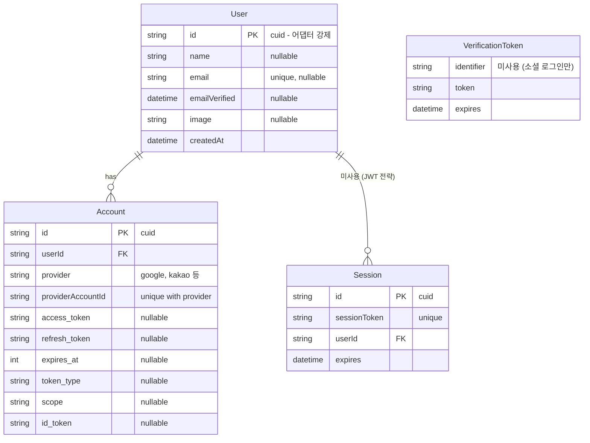
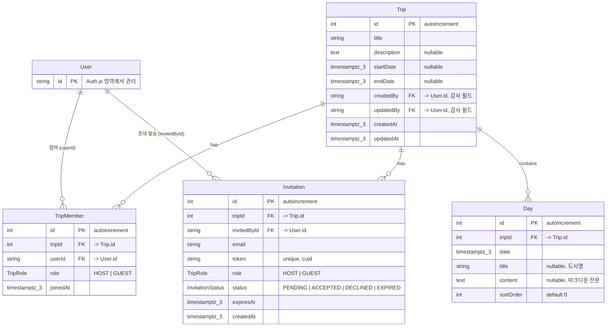

# Data Model: 풀스택 전환

**Date**: 2026-04-14
**Feature**: [spec.md](spec.md)

## ERD

### Auth.js 영역 (PK: String cuid, 어댑터 강제)

> User 테이블이 두 영역의 경계점이다. Auth.js가 생성/관리하며, 비즈니스 모델에서 FK로 참조한다.



### 비즈니스 영역 (PK: Int autoincrement, timestamptz(3))

> User FK(ownerId, userId, invitedById)만 String이다 (Auth.js 제약). 나머지 FK(tripId)는 Int.



## 설계 결정

### D-001: User 테이블 명명

**결정**: Auth.js 표준인 `User`를 그대로 사용한다.

**배경**: Spring 기반에서는 `Member`를 서비스 사용자 테이블로 흔히 사용하지만, Auth.js PrismaAdapter는 `User` 모델명을 강제한다. `@@map("users")`로 DB 테이블명은 `users`로 매핑.

**`TripMember` 테이블의 역할**: 서비스 회원이 아니라 **여행-사용자 간 참여 관계** (join table with role). 아래 개념으로 분리된다:

| 개념 | 모델 | 설명 |
|------|------|------|
| 서비스 사용자 | `User` | Auth.js가 관리. 소셜 로그인 시 자동 생성 |
| 여행 참여자 | `TripMember` | 특정 여행에 대한 역할(HOST/GUEST) |

### D-005: PK 전략 — Auth.js 제약 수용 + 비즈니스 모델 Int

**결정**: Auth.js 영역은 String(cuid), App 영역은 Int(autoincrement).

**Auth.js 제약**: PrismaAdapter가 User/Account/Session의 PK를 `String @default(cuid())`로 강제한다. 이를 변경하려면 어댑터를 포크해야 하므로 수용한다.

**비즈니스 모델**: Trip, Day, TripMember, Invitation은 `Int @default(autoincrement())`를 사용한다. 분산 생성이 불필요한 소규모 프로젝트에서 시퀀스가 인덱스 효율, 가독성, URL 길이 모두에서 유리하다.

**FK 타입 혼용**: 비즈니스 모델에서 User를 참조하는 FK(createdBy, updatedBy, userId, invitedById)만 String이고, 나머지 FK(tripId 등)는 Int이다. Auth.js 영역과 비즈니스 영역이 명확히 분리되므로 혼란은 없다.

| 영역 | 모델 | PK | 이유 |
|------|------|----|------|
| Auth.js | User, Account, Session, VerificationToken | String (cuid) | 어댑터 강제 |
| 비즈니스 | Trip, Day, TripMember, Invitation | Int (autoincrement) | 시퀀스 효율 |

### D-002: 다중 OAuth 프로바이더와 계정 병합

**결정**: 현재는 Google 단일 프로바이더. 추후 프로바이더 추가 시 이메일 기반 자동 병합을 검토한다.

**현재 구조**:
- `User` 1 : N `Account` — 한 사용자에 여러 소셜 계정 연결 가능
- Auth.js 기본 동작: 같은 이메일이라도 다른 프로바이더면 **자동 연결하지 않음** (보안상 이유)

**시나리오 (추후)**:

```
1. Google(a@gmail.com) 로그인 → User A 생성 + Account(google)
2. Kakao(a@gmail.com) 로그인 → 기본: 에러 / 설정 시: User A에 Account(kakao) 추가
```

**옵션**:
- `allowDangerousEmailAccountLinking: true` — 이메일 일치 시 자동 연결 (간편하나 이메일 미인증 프로바이더에서 위험)
- 수동 연결 UI — 로그인 후 "다른 계정 연결" 기능 (안전하지만 구현 비용)

**결정 변경**: `allowDangerousEmailAccountLinking: true` 적용. Google/카카오 등 대형 프로바이더는 이메일 인증을 보장하므로 이메일 기반 자동 병합은 안전하다. 이메일 인증이 없는 소규모 프로바이더는 추가하지 않는다.

### D-003: 세션 전략 — JWT vs Database Session

**결정**: JWT 전략을 사용한다.

**배경**: 웹 인증에서 세션 관리는 크게 두 가지 전략이 있다.

#### Database Session (서버 세션)

```
[브라우저] ──cookie(sessionToken)──→ [서버] ──SELECT──→ [DB: sessions 테이블]
                                      ↓
                                   사용자 정보 반환
```

- 요청마다 DB를 조회하여 세션 유효성을 확인한다
- 서버가 세션을 즉시 무효화할 수 있다 (강제 로그아웃, 세션 탈취 대응)
- Redis 등 인메모리 캐시를 앞에 두면 DB 부하를 줄일 수 있다
- MSA에서는 세션 저장소를 공유해야 하므로 별도 Redis 클러스터가 필요하다
- Auth.js의 Session, VerificationToken 테이블이 이 전략에서 사용된다

#### JWT (토큰 기반)

```
[브라우저] ──cookie(JWT)──→ [서버] ──서명 검증만──→ 사용자 정보 반환
                                   (DB 조회 없음)
```

- JWT에 사용자 정보(id, email, role 등)를 암호화하여 클라이언트 쿠키에 저장한다
- 서버는 비밀키(AUTH_SECRET)로 서명을 검증만 하면 되므로 DB 조회가 불필요하다
- Edge Runtime(Vercel 미들웨어)에서도 동작한다 — DB 커넥션이 필요 없으므로
- 서버에서 토큰을 즉시 무효화할 수 없다 (만료까지 유효). 탈취 대응이 DB 세션보다 느리다
- MSA에서 유리하다 — 각 서비스가 독립적으로 토큰을 검증할 수 있다

#### 이 프로젝트에서 JWT를 선택한 이유

| 기준 | JWT | DB Session |
|------|-----|------------|
| Vercel Edge 미들웨어 호환 | O (DB 불필요) | X (DB 조회 필요) |
| Neon cold start 영향 | 없음 | 매 요청마다 지연 가능 |
| 세션 즉시 무효화 | X (만료까지 유효) | O |
| 인프라 복잡도 | 낮음 (비밀키만 관리) | 높음 (Redis 또는 DB 부하) |
| 사용자 규모 | 10명 이내, 무효화 필요성 낮음 | 대규모 서비스에 적합 |

- Vercel의 Edge 미들웨어에서 인증을 검사하려면 JWT가 필수다. DB Session은 Edge Runtime에서 DB에 접근할 수 없어 사용 불가.
- Neon은 5분 idle 후 cold start가 1~2초 발생한다. JWT는 이 지연을 완전히 회피한다.
- 사용자 10명 이내의 개인 프로젝트이므로, 세션 즉시 무효화가 필요한 보안 시나리오(계정 탈취, 강제 로그아웃)는 현실적으로 발생하지 않는다.

#### Auth.js에서의 설정

```typescript
// auth.ts — JWT 전략 선언
export const { handlers, auth, signIn, signOut } = NextAuth({
  adapter: PrismaAdapter(prisma),
  session: { strategy: "jwt" },  // ← 이 한 줄이 전략 결정
  ...authConfig,
});
```

**adapter + JWT 조합**: PrismaAdapter는 User/Account 저장에만 사용되고, 세션은 JWT 쿠키로 관리된다. DB의 Session 테이블에는 데이터가 쌓이지 않는다.

#### 미사용 테이블 정리

| 테이블 | 용도 | 현재 상태 |
|--------|------|----------|
| `sessions` | DB 세션 저장 | JWT 전략이므로 **미사용** (스키마만 존재) |
| `verification_tokens` | 이메일 매직 링크 인증 | 소셜 로그인만 사용하므로 **미사용** |

두 테이블 모두 Auth.js PrismaAdapter가 스키마를 강제하므로 DDL에는 존재하지만, 런타임에 데이터가 쌓이지 않는다. 향후 이메일 로그인이나 DB 세션 전략으로 전환할 때 활성화된다.

### D-004: 시간 저장 전략 — timestamptz (KST 베이스)

**결정**: 모든 DateTime 필드에 `timestamptz` (timestamp with time zone)를 사용한다. 애플리케이션의 기준 시간대는 KST(UTC+9)이다.

**배경**: PostgreSQL의 시간 타입은 두 가지이다.

| 타입 | PostgreSQL | 저장 방식 | 변환 |
|------|-----------|----------|------|
| `timestamp` | timestamp without time zone | 입력값 그대로 저장 | 없음 |
| `timestamptz` | timestamp with time zone | UTC로 변환하여 저장 | 읽을 때 세션 TZ로 변환 |

```
-- timestamptz 동작 예시
SET timezone = 'Asia/Seoul';
INSERT INTO trips (created_at) VALUES ('2026-06-07 09:00:00+09');
-- 내부 저장: 2026-06-07 00:00:00 UTC
-- KST 세션에서 조회: 2026-06-07 09:00:00+09
-- UTC 세션에서 조회: 2026-06-07 00:00:00+00
```

**Java 대응**: `timestamptz`는 Java의 `ZonedDateTime`/`OffsetDateTime`에 대응한다. `timestamp`는 `LocalDateTime`에 대응 (시간대 정보 없음).

**Prisma에서의 적용**:

```prisma
// 기본 DateTime → timestamp(3) (시간대 없음, 밀리초)
createdAt DateTime

// @db.Timestamptz(3) → timestamptz(3) (시간대 있음, 밀리초) ✅ 이것을 사용
createdAt DateTime @db.Timestamptz(3)
```

**정밀도 (3) = 밀리초 절삭**:

| 정밀도 | PostgreSQL | 소수 자릿수 | 대응 |
|--------|-----------|-----------|------|
| (0) | timestamptz(0) | 초 단위 | - |
| (3) | timestamptz(3) | 밀리초 (0.001초) | JS Date, Java Instant.truncatedTo(MILLIS) |
| (6) | timestamptz(6) | 마이크로초 (기본값) | Java Instant 기본 |

- PostgreSQL 기본은 `(6)` 마이크로초이지만, 웹앱에서 불필요한 정밀도이다
- JavaScript의 `Date` 객체가 밀리초까지만 지원하므로 `(3)`이 자연스럽다
- 나노초(9)는 PostgreSQL이 지원하지 않으며, 마이크로초(6)도 JS에서 손실된다

**KST 베이스 운영**:
- DB 저장: UTC (PostgreSQL 표준)
- Neon DB 세션 기본 TZ: UTC
- 애플리케이션 표시: KST로 변환 (`Asia/Seoul`)
- 개인 개발자 + 한국 사용자 대상이므로 다중 TZ 고려 불필요

**Auth.js 테이블 제외**: User, Account, Session, VerificationToken은 Auth.js PrismaAdapter가 스키마를 관리하므로 `@db.Timestamptz()` 미적용. 비즈니스 모델(Trip, Day, TripMember, Invitation)에만 적용한다.

### D-006: 권한 모델 — HOST/GUEST 2권한 + 오너 없음

**결정**: TripMember.role은 HOST / GUEST 2단계. 오너 개념 없음. 다중 호스트 허용.

**스펙**:
1. 여행 생성자는 HOST로 TripMember에 등록
2. 초대 시 HOST 또는 GUEST로 초대 가능
3. 호스트는 게스트를 호스트로 승격 가능
4. Trip 테이블에 ownerId 없음 — createdBy/updatedBy는 감사(audit) 필드일 뿐 권한과 무관
5. 다중 호스트이므로 오너 양도 개념 없음

**트레이드오프**: 다른 호스트가 여행을 삭제할 수 있다. 개인 프로젝트 특성상 방어하지 않는다.

**확장 포인트**: 추후 오너/잠금이 필요하면 `TripMember`에 `isOwner Boolean @default(false)` 컬럼 추가 + `Trip.createdBy` 기반 백필. 별도 마이그레이션 없이 확장 가능.

## Entities

### User

서비스 사용자. 소셜 로그인으로 자동 생성. (Auth.js 관리)

| Field | Type | Constraints | Notes |
|-------|------|-------------|-------|
| id | string | PK, cuid | Auth.js 강제 |
| name | string | nullable | 소셜 계정에서 가져옴 |
| email | string | unique, nullable | 소셜 계정에서 가져옴 |
| emailVerified | datetime | nullable | Auth.js 표준 |
| image | string | nullable | 프로필 이미지 URL |
| createdAt | datetime | default now | |

**Relationships**: has TripMember (1:N), created Invitation (1:N)

### Trip

여행 단위. 호스트가 생성하고 동행자와 공유.

| Field | Type | Constraints | Notes |
|-------|------|-------------|-------|
| id | int | PK, autoincrement | |
| title | string | required | |
| description | text | nullable | 여행 개요 |
| startDate | timestamptz(3) | nullable | |
| endDate | timestamptz(3) | nullable | |
| createdBy | string | FK -> User.id | 감사 필드, 권한 무관 |
| updatedBy | string | FK -> User.id | 감사 필드, 권한 무관 |
| createdAt | timestamptz(3) | default now | |
| updatedAt | timestamptz(3) | auto-updated | |

**Relationships**: has Day (1:N), has TripMember (1:N), has Invitation (1:N)

### Day

일별 일정. 하루 단위 텍스트 블록.

| Field | Type | Constraints | Notes |
|-------|------|-------------|-------|
| id | int | PK, autoincrement | |
| tripId | int | FK -> Trip.id, cascade delete | |
| date | timestamptz(3) | required | 일정 날짜 |
| title | string | nullable | 도시명 등 간략 제목 |
| content | text | nullable | 마크다운 전문 |
| sortOrder | int | default 0 | 정렬 순서 |

**Index**: (tripId, date)

### TripMember

여행 참여자. 호스트/게스트 역할 관리.

| Field | Type | Constraints | Notes |
|-------|------|-------------|-------|
| id | int | PK, autoincrement | |
| tripId | int | FK -> Trip.id, cascade delete | |
| userId | string | FK -> User.id, cascade delete | |
| role | enum | HOST / GUEST, default GUEST | |
| joinedAt | timestamptz(3) | default now | |

**Unique constraint**: (tripId, userId)

### Invitation

팀 초대. 토큰 기반, 7일 만료.

| Field | Type | Constraints | Notes |
|-------|------|-------------|-------|
| id | int | PK, autoincrement | |
| tripId | int | FK -> Trip.id, cascade delete | |
| invitedById | string | FK -> User.id | 초대자 (HOST만 가능) |
| email | string | required | 초대 대상 이메일 |
| token | string | unique, cuid | 불투명 토큰 |
| role | enum | HOST / GUEST, default GUEST | 합류 시 부여할 역할 |
| status | enum | PENDING / ACCEPTED / DECLINED / EXPIRED | |
| expiresAt | timestamptz(3) | required | 생성 시점 + 7일 |
| createdAt | timestamptz(3) | default now | |

**Index**: (token), (email, status)

### Auth.js 표준 모델

Auth.js PrismaAdapter가 요구하는 모델. 직접 조작하지 않음.

- **Account**: 소셜 프로바이더 연동 정보 (provider, providerAccountId, tokens)
- **Session**: DB 세션 (JWT 전략이므로 미사용, 스키마만 존재)
- **VerificationToken**: 이메일 인증 토큰 (소셜 로그인만 사용하므로 미사용)

## 권한 모델

| 권한 | HOST | GUEST |
|------|------|-------|
| 여행 조회 | O | O |
| 일정 조회 | O | O |
| 일정 편집 | O | O |
| 일정 추가/삭제 | O | O |
| 개요 편집 | O | O |
| 동행자 초대 | O | X |
| 게스트→호스트 승격 | O | X |
| 여행 삭제 | O | X |

## 상태 전이

### Invitation

```
PENDING -> ACCEPTED (사용자가 초대 수락)
PENDING -> EXPIRED (7일 경과 또는 새 초대로 대체)
PENDING -> DECLINED (사용자가 초대 거절, 현재 UI 미구현)
```

## 마이그레이션 매핑

기존 마크다운 파일에서 DB로의 데이터 이전 계획.

| 마크다운 소스 | DB 모델 | 변환 방식 |
|-------------|---------|----------|
| `trips/{slug}/` 폴더명 | `Trip.title` | slug에서 파싱 |
| `overview.md` 기간 | `Trip.startDate`, `Trip.endDate` | 날짜 파싱 |
| `overview.md` 전문 | `Trip.description` | 마크다운 그대로 저장 |
| `daily/dayNN-*.md` 각 파일 | `Day` 레코드 | 파일 1개 = Day 1개 |
| `daily/dayNN-*.md` 파일명 | `Day.date`, `Day.title` | 파일명에서 날짜/도시명 파싱 |
| `daily/dayNN-*.md` 내용 | `Day.content` | 마크다운 전문 |
| 부속 문서 (budget, transport 등) | 마이그레이션 대상 아님 | 파일 유지 |
| 현재 로그인 사용자 | `Trip.createdBy` + `TripMember(HOST)` | 마이그레이션 실행자 = 생성자 겸 호스트 |
