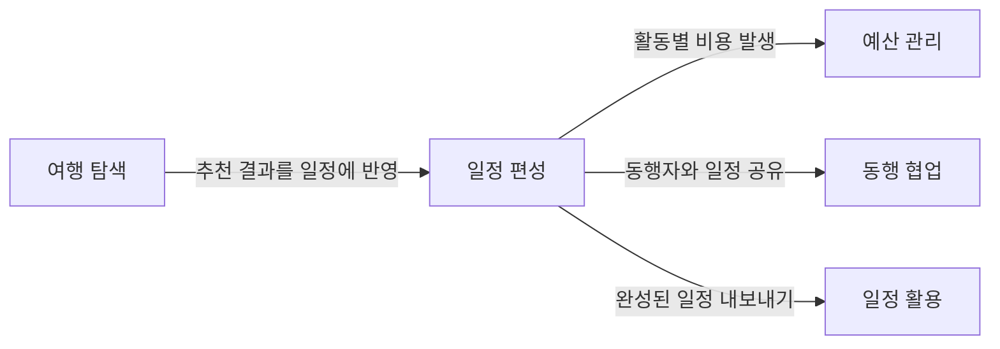

# 스펙 (speckit)

이 디렉터리는 피처별 스펙 산출물을 담습니다. 이 프로젝트는 **사양 우선(spec-driven)** 으로 굴러갑니다 — 코드보다 스펙을 먼저 쓰고, 스펙과 실제 산출물이 어긋나지 않도록 자동 게이트로 강제합니다. 여기서는 그 방식을 먼저 설명하고, 이어서 기획 도메인과 스펙 현황을 정리합니다.

> 굳이 여기까지 들어온 분을 위한 상세입니다. 큰 그림만 필요하면 [docs/ARCHITECTURE.md](../docs/ARCHITECTURE.md)의 "스펙·품질 관리" 한 절이면 충분합니다.

## speckit이란

GitHub Spec Kit 기반의 사양 우선 워크플로우입니다. 피처 하나를 세 단계 산출물로 나눠 만듭니다.

- **spec** (`spec.md`) — 무엇을·왜(WHAT·WHY)만 담습니다. 구체적 도구·구현은 넣지 않습니다.
- **plan** (`plan.md`) — 어떻게(HOW). 기술 선택·설계·커버리지 목표를 정합니다.
- **tasks** (`tasks.md`) — 실행 단위 체크리스트. 각 태스크가 산출 파일과 매핑됩니다.

`spec → plan → tasks` 순으로 만들고, 피처 브랜치는 `NNN-short-name`(3자리 일련번호)을 받습니다.

## 메타태그 하네스

스펙과 실제 코드가 시간이 지나며 어긋나는(drift) 것을 막기 위해, 산출물에 4종 메타태그를 답니다.

| 태그 | 의미 | 위치 |
|------|------|------|
| `[artifact: <path>]` | 산출 파일 경로. drift 감사 기준 | `tasks.md` 체크박스 |
| `[why: <tag>]` | 추적 그룹 키. plan↔tasks 커버리지 합산 | `tasks.md`, `plan.md` |
| `[multi-step: N]` | 다단 작업의 최소 매핑 태스크 수 | `plan.md` |
| `[migration-type: ...]` | 마이그레이션 성격(schema-only / data-migration) | 마이그레이션 SQL 헤더 |

`validate-*.sh` 스택이 형식 정합·plan↔tasks 커버리지·drift(선언 대비 실제 산출물)를 검사합니다. PR 단계는 `.github/workflows/speckit-gate.yml`, 주간 drift 점검은 `drift-audit.yml`이 맡습니다. 하네스 자체의 스펙은 [_infra/010-speckit-harness/](_infra/010-speckit-harness/)에 있습니다.

## rollout phase

하네스는 `expand → migrate → contract` 3단계로 도입됐고, 현재는 **contract** — quickstart 증거·마이그레이션 메타·drift 오류가 머지를 차단합니다.

---

## 도메인

기획 관점의 도메인 정의입니다. 기술 구현은 [docs/](../docs/README.md) 참조.

| # | 도메인 | 사용자 질문 | 설명 | 디렉토리 |
|---|--------|-----------|------|---------|
| 1 | **여행 탐색** | 어디 가지? 뭐 하지? | 숙소, 항공편, 관광지, 식당 검색 및 추천 | [travel-search/](travel-search/) |
| 2 | **일정 편성** | 언제 뭘 하지? | 일자별 활동 구성, 시간/장소/예약 상태 관리 | [itinerary/](itinerary/) |
| 3 | **예산 관리** | 얼마 쓰지? | 활동별 비용 추적, 통화 구분, 결제 수단 | (미착수) |
| 4 | **동행 협업** | 누구랑 가지? | 동행자 초대, 역할 관리, 공동 편집 | [collaboration/](collaboration/) |
| 5 | **일정 활용** | 어떻게 보지? | 캘린더 연동, PDF 추출, 모바일 접근 | [export/](export/) |

## 도메인 관계

## 크로스 도메인 규칙

원칙, 소유권 매트릭스, 금지 사항은 [헌법 V. Cross-Domain Integrity](../.specify/memory/constitution.md) 참조.

### 크로스 도메인 사례 (기획 관점)

| 사례 | 원천 → 참조 | 허용 방식 |
|------|-----------|----------|
| 검색 결과를 활동으로 추가 | 여행 탐색 → 일정 편성 | 사용자가 직접 전환 (시스템 자동 아님) |
| 활동 생성 시 권한 확인 | 동행 협업 → 일정 편성 | 일정 편성이 동행 협업에 권한 질의 |
| 활동 비용을 예산에 집계 | 일정 편성 → 예산 관리 | 이벤트: ActivityCreated → 예산 반영 |
| 일정을 캘린더로 내보내기 | 일정 편성 → 일정 활용 | 일정 활용이 일정 편성 데이터 조회 |

### 권한

[헌법 VI. Role-Based Access Control](../.specify/memory/constitution.md) 참조.

## 스펙 현황

| 도메인 | 스펙 | 릴리즈 | 비고 |
|--------|------|------|------|
| 여행 탐색 | [001 여행 검색 MCP](travel-search/001-ax-travel-planning/) | v1.0.0 | |
| 여행 탐색 | [005 API 연동](travel-search/005-ax-api-mcp/) | v2.0.0 | |
| 일정 편성 | [006 구조화 활동](itinerary/006-structured-activity/) | v2.1.0 | |
| 일정 편성 | [015 Day 스키마 재설계 + API v2](015-day-schema-redesign/) | v2.7.0 | expand-and-contract: expand+migrate |
| 일정 편성 | [016 Day.sortOrder DROP](016-sortorder-drop/) | v2.7.1 | expand-and-contract: contract |
| 동행 협업 | [004 풀스택 전환](collaboration/004-fullstack-transition/) | v2.0.0 | |
| 동행 협업 | [007 OAuth CLI 재인증](collaboration/007-oauth-cli-reauth/) | v2.2.0 | |
| 동행 협업 | [023 동행자 목록 주인+호스트 복수 뱃지](023-role-badges/) | v2.10.0 | 역할 포함 관계 UI 표면화 |
| 일정 활용 | [002 iCal 번들](export/002-bundle-ical-mcp/) | v1.x | PDF 미구현 |
| 일정 활용 | [018 Google Calendar 연동 (per-user)](018-gcal-integration/) | v2.8.0 | 레거시 모델, 후속 contract 대상 |
| 일정 활용 | [019 GCal 공유 플로우 재설계](019-gcal-shared-flow/) | v2.9.0 | per-trip 공유 정본 |
| 일정 활용 | [020 공유 캘린더 미연결 역할별 UI](020-shared-calendar-not-linked/) | v2.9.1 | |
| 일정 활용 | [021 GCal 권한 제약 감지·안내](021-gcal-access-guide/) | v2.9.2 | OAuth Testing 모드 안내 |
| 일정 활용 | [022 레거시 캘린더 contract 정리](022-gcal-legacy-contract/) | v2.10.0 | 매핑 expand 단계. 레거시 테이블 DROP은 후속 |
| UI/디자인 | [011 프로젝트 아이덴티티 표면](011-project-identity-surface/) | v2.4.0 | |
| UI/디자인 | [012 shadcn 디자인 시스템 기반](012-shadcn-design-system/) | v2.4.3 | |
| UI/디자인 | [013 shadcn Phase 2](013-shadcn-phase2/) | v2.5.0 | |
| UI/디자인 | [014 랜딩·문서 정비](014-landing-docs-refresh/) | v2.6.0 | |
| 인프라 | [017 Neon DB 환경별 분리](017-neon-db-split/) | v2.7.2 | preview/dev DB 격리 |
| 예산 관리 | — | — | 미착수 |

> 은퇴: [_retired/](_retired/) (003 동행자 피드백 채널은 v2.0.0 AX 방향 전환으로 폐기)
> 인프라: [_infra/](_infra/) (009 Git 릴리즈 전략, 010 speckit 하네스)
