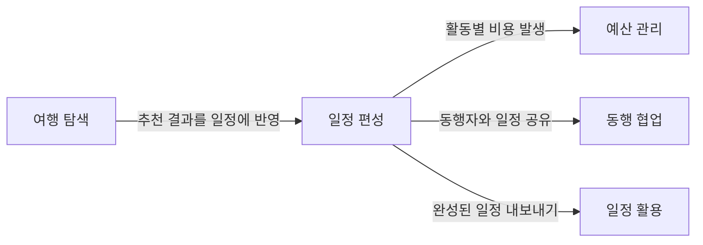

# 스펙 도메인

기획 관점의 도메인 정의. 기술 구현은 [docs/](../docs/README.md) 참조.

## 도메인

| # | 도메인 | 사용자 질문 | 설명 | 디렉토리 |
|---|--------|-----------|------|---------|
| 1 | **여행 탐색** | 어디 가지? 뭐 하지? | 숙소, 항공편, 관광지, 식당 검색 및 추천 | [travel-search/](travel-search/) |
| 2 | **일정 편성** | 언제 뭘 하지? | 일자별 활동 구성, 시간/장소/예약 상태 관리 | [itinerary/](itinerary/) |
| 3 | **예산 관리** | 얼마 쓰지? | 활동별 비용 추적, 통화 구분, 결제 수단 | (미착수) |
| 4 | **동행 협업** | 누구랑 가지? | 동행자 초대, 역할 관리, 공동 편집 | [collaboration/](collaboration/) |
| 5 | **일정 활용** | 어떻게 보지? | 캘린더 연동, PDF 추출, 모바일 접근 | [export/](export/) |

## 도메인 관계

## 크로스 도메인 규칙

원칙, 소유권 매트릭스, 금지 사항은 [헌법 V. Cross-Domain Integrity](../.specify/memory/constitution.md) 참조.

### 크로스 도메인 사례 (기획 관점)

| 사례 | 원천 → 참조 | 허용 방식 |
|------|-----------|----------|
| 검색 결과를 활동으로 추가 | 여행 탐색 → 일정 편성 | 사용자가 직접 전환 (시스템 자동 아님) |
| 활동 생성 시 권한 확인 | 동행 협업 → 일정 편성 | 일정 편성이 동행 협업에 권한 질의 |
| 활동 비용을 예산에 집계 | 일정 편성 → 예산 관리 | 이벤트: ActivityCreated → 예산 반영 |
| 일정을 캘린더로 내보내기 | 일정 편성 → 일정 활용 | 일정 활용이 일정 편성 데이터 조회 |

### 권한

[헌법 VI. Role-Based Access Control](../.specify/memory/constitution.md) 참조.

## 스펙 현황

| 도메인 | 스펙 | 상태 |
|--------|------|------|
| 여행 탐색 | 001 여행 검색 MCP | 완료 |
| 여행 탐색 | 005 API 연동 | 완료 |
| 일정 편성 | 006 구조화 활동 | 완료 |
| 동행 협업 | 004 풀스택 전환 | 완료 |
| 동행 협업 | 007 OAuth CLI 재인증 | 완료 |
| 일정 활용 | 002 iCal 번들 | 완료 (PDF 미구현) |
| 예산 관리 | — | 미착수 |

> 은퇴: [_retired/](_retired/) | 인프라: [_infra/](_infra/)
